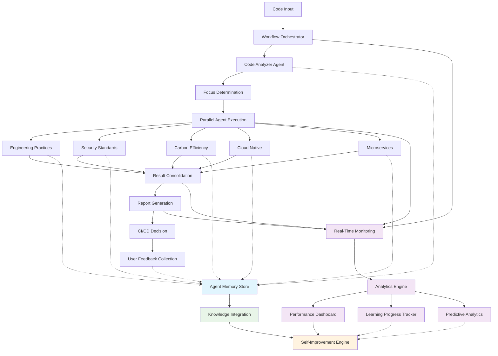

# Agentic Code Review Agent - Implementation Status & Design Documentation

**Comprehensive Review of Multi-Agent Code Review System**

---

## Table of Contents

1. [Executive Summary](#executive-summary)
2. [Abbreviations and Terminology](#abbreviations-and-terminology)
3. [Current Implementation Status](#current-implementation-status)
4. [Architecture Overview](#architecture-overview)
5. [System Flow Detailed Breakdown](#system-flow-detailed-breakdown)
6. [Agent Memory and Knowledge Store](#agent-memory-and-knowledge-store)
7. [Observability and Analytics](#observability-and-analytics)
8. [Agent Implementations](#agent-implementations)
9. [Configuration Management](#configuration-management)
10. [Workflow Orchestration](#workflow-orchestration)
11. [Bias and Hallucination Prevention](#bias-and-hallucination-prevention)
12. [Implementation Gaps](#implementation-gaps)
13. [CI/CD Integration Strategy](#cicd-integration-strategy)
14. [End-to-End Workflow](#end-to-end-workflow)
15. [Centralized Configuration System](#centralized-configuration-system)
16. [Recommendations](#recommendations)

---

## Executive Summary

The Agentic Code Review Agent is a sophisticated multi-agent system built on **LangGraph** that performs comprehensive code analysis across multiple dimensions. The system demonstrates strong foundational architecture with specialized agents, configurable LLM integration, and extensible workflow orchestration.

### Current Status: **60% Complete**

**Strengths:**
- ✅ Solid LangGraph-based workflow orchestration
- ✅ Six specialized agents with clear separation of concerns
- ✅ Comprehensive configuration management via YAML
- ✅ LLM provider abstraction with fallback support
- ✅ Robust state management and error handling

**Critical Gaps:**
- ❌ **Language Independence**: Currently Python-only AST parsing via ast module
- ❌ Incomplete bias detection and hallucination prevention
- ❌ Limited CI/CD integration implementations
- ❌ Partial agent logic in several specialized areas
- ❌ Missing comprehensive testing framework
- ❌ No production-ready deployment configurations

---

## Abbreviations and Terminology

### **Technical Abbreviations**

| Abbreviation | Full Form | Definition |
|--------------|-----------|------------|
| **AST** | Abstract Syntax Tree | A tree representation of the syntactic structure of source code |
| **AI** | Artificial Intelligence | Computer systems that perform tasks typically requiring human intelligence |
| **API** | Application Programming Interface | Set of protocols and tools for building software applications |
| **CI/CD** | Continuous Integration/Continuous Deployment | Software development practices for frequent code integration and deployment |
| **CLI** | Command Line Interface | Text-based interface for interacting with software |
| **CWE** | Common Weakness Enumeration | Community-developed list of software and hardware weakness types |
| **CVSS** | Common Vulnerability Scoring System | Standard for assessing and rating security vulnerabilities |
| **GDPR** | General Data Protection Regulation | European Union regulation on data protection and privacy |
| **HTML** | HyperText Markup Language | Standard markup language for web pages |
| **HTTP** | HyperText Transfer Protocol | Application protocol for distributed hypermedia information systems |
| **JSON** | JavaScript Object Notation | Lightweight data interchange format |
| **JWT** | JSON Web Token | Compact, URL-safe token format for representing claims securely |
| **LLM** | Large Language Model | AI model trained on large amounts of text data for language understanding |
| **ML** | Machine Learning | Type of AI that enables computers to learn without explicit programming |
| **MVC** | Model-View-Controller | Architectural pattern separating application logic into three components |
| **NIST** | National Institute of Standards and Technology | US federal agency developing technology standards |
| **OOP** | Object-Oriented Programming | Programming paradigm based on the concept of objects |
| **OWASP** | Open Web Application Security Project | Non-profit foundation focused on improving software security |
| **PCI-DSS** | Payment Card Industry Data Security Standard | Security standard for organizations handling credit cards |
| **PDF** | Portable Document Format | File format for presenting documents independently of software/hardware |
| **PEP** | Python Enhancement Proposal | Design document providing information to Python community |
| **REST** | Representational State Transfer | Architectural style for designing networked applications |
| **SOX** | Sarbanes-Oxley Act | US federal law setting new standards for public company boards |
| **SQL** | Structured Query Language | Domain-specific language for managing relational databases |
| **URI** | Uniform Resource Identifier | String of characters that unambiguously identifies a resource |
| **URL** | Uniform Resource Locator | Reference to a web resource that specifies its location |
| **YAML** | YAML Ain't Markup Language | Human-readable data serialization standard |

### **Software Engineering Terms**

| Term | Definition |
|------|------------|
| **Agentic System** | AI system composed of multiple autonomous agents working together |
| **Complexity Metrics** | Quantitative measures of software complexity (cyclomatic, cognitive, Halstead) |
| **Cyclomatic Complexity** | Metric measuring number of linearly independent paths through program code |
| **Cognitive Complexity** | Metric measuring how difficult code is to understand mentally |
| **Halstead Metrics** | Set of software metrics based on the number of operators and operands |
| **Maintainability Index** | Composite metric indicating how maintainable source code is |
| **Technical Debt** | Cost of additional rework caused by choosing easy solution instead of better approach |
| **Code Smell** | Surface indication that usually corresponds to deeper problem in the system |
| **Anti-Pattern** | Common response to recurring problem that is usually ineffective |
| **Refactoring** | Process of restructuring existing code without changing its external behavior |

### **Architecture and Design Patterns**

| Term | Definition |
|------|------------|
| **12-Factor App** | Methodology for building software-as-a-service applications |
| **Cloud Native** | Approach to building and running applications that exploits cloud computing |
| **Container** | Lightweight, portable software package containing everything needed to run application |
| **Microservices** | Architectural style structuring application as collection of loosely coupled services |
| **Service Mesh** | Infrastructure layer handling service-to-service communication |
| **SOLID Principles** | Five design principles (Single Responsibility, Open/Closed, Liskov Substitution, Interface Segregation, Dependency Inversion) |
| **Tree-sitter** | Parser generator tool and incremental parsing library |
| **Workflow Orchestration** | Coordination of multiple software and data services together |

### **Quality and Security Terms**

| Term | Definition |
|------|------------|
| **Bias Prevention** | Techniques to prevent systematic errors or prejudices in AI systems |
| **Code Coverage** | Measure of how much source code is executed during testing |
| **Cross-Validation** | Technique for assessing how results will generalize to independent dataset |
| **False Positive** | Test result incorrectly indicating presence of a condition |
| **Hallucination Prevention** | Techniques to prevent AI from generating false or misleading information |
| **Static Analysis** | Method of analyzing code without executing it |
| **Vulnerability** | Weakness in system that can be exploited by threats |
| **Threat Modeling** | Process of identifying and evaluating potential threats to system |

### **Frameworks and Technologies**

| Technology | Description |
|------------|-------------|
| **LangGraph** | Framework for building stateful, multi-agent applications with LLMs |
| **Ollama** | Platform for running large language models locally |
| **Spring** | Comprehensive programming and configuration model for Java applications |
| **React** | JavaScript library for building user interfaces |
| **Angular** | Platform for building mobile and desktop web applications |
| **Node.js** | JavaScript runtime built on Chrome's V8 JavaScript engine |
| **.NET** | Developer platform for building different types of applications |
| **Kubernetes** | Container orchestration platform for automating deployment and management |
| **Docker** | Platform for developing, shipping, and running applications in containers |
| **Maven/Gradle** | Build automation tools for Java projects |

---

## Current Implementation Status

### ✅ **Fully Implemented Components**

#### 1. **Core Architecture & Workflow Orchestration**
- **LangGraph Workflow**: Complete state-based orchestration (`src/workflow/code_review_workflow.py`)
- **State Management**: Comprehensive state models with type safety (`src/workflow/state_models.py`)
- **Workflow Builder**: Dynamic workflow construction with agent routing
- **Error Handling**: Robust exception handling with graceful degradation

#### 2. **Base Agent Infrastructure**
- **Base Agent Class**: Abstract foundation with standardized interfaces (`src/agents/base_agent.py`)
- **LLM Integration**: Seamless integration with multiple providers
- **Performance Monitoring**: Execution time tracking and metrics collection
- **Finding/Recommendation Creation**: Standardized output structures

#### 3. **Configuration Management System**
- **YAML-Based Configuration**: Extensive configuration files for all agents
- **LLM Configuration**: Provider-specific settings with fallback support
- **Agent Configuration**: Specialized configs for each analysis type
- **Environment Management**: Development, staging, production configurations

#### 4. **Specialized Agent Implementations**

##### **Code Analyzer Agent** (60% Complete - Needs Language Independence)
- ❌ Multi-language AST parsing (currently Python-only via ast module)
- ❌ Support for target languages: Java, TypeScript, JavaScript, Swift, Kotlin, Python, SQL, Go, Rust, C#
- ✅ Complexity metrics calculation (basic implementation)
- ✅ Generic file analysis
- ✅ Pattern detection
- ✅ Architecture type identification
- ❌ Language-agnostic parsing infrastructure using Tree-sitter

##### **Engineering Practices Agent** (75% Complete)
- ✅ SOLID principles evaluation framework
- ✅ Design pattern detection
- ✅ Code quality metrics
- ✅ Testing practices analysis
- ❌ Complete implementation of all quality checks

##### **Security Standards Agent** (60% Complete)
- ✅ OWASP framework integration
- ✅ Vulnerability detection patterns
- ❌ Complete security rule implementations
- ❌ CWE mapping and compliance checking

##### **Carbon Efficiency Agent** (50% Complete)
- ✅ Basic energy efficiency analysis
- ❌ Detailed carbon footprint calculation
- ❌ Green computing recommendations

##### **Cloud Native Agent** (40% Complete)
- ✅ 12-factor app compliance framework
- ❌ Container analysis implementation
- ❌ Kubernetes readiness assessment

##### **Microservices Agent** (40% Complete)
- ✅ Service boundary analysis framework
- ❌ API design evaluation
- ❌ Data consistency pattern analysis

### 🔄 **Partially Implemented Components**

#### 1. **LLM Manager Integration**
- ✅ Client architecture and request/response handling
- ✅ Provider abstraction (Ollama, OpenAI, Gemini)
- ❌ Complete error handling and retry logic
- ❌ Cost optimization and rate limiting

#### 2. **Report Generation**
- ✅ Basic report structure and data models
- ❌ HTML/PDF generation
- ❌ Executive summary generation
- ❌ Visualization and charts

#### 3. **CI/CD Integration**
- ✅ Webhook handling framework
- ❌ GitHub Actions integration
- ❌ GitLab CI integration
- ❌ Jenkins pipeline support

### ❌ **Missing Components**

1. **Agent Memory and Knowledge Store System**
   - Multi-layered memory architecture (short-term, working, long-term, episodic, semantic)
   - Persistent knowledge storage and retrieval
   - Self-improvement mechanisms based on feedback
   - Cross-agent learning and knowledge transfer

2. **Comprehensive Observability Framework**
   - Real-time monitoring and performance tracking
   - Agent learning progress analytics
   - Predictive performance modeling
   - Comparative agent analysis and benchmarking

3. **Analytics and Reporting Dashboard**
   - System-wide performance dashboard
   - Individual agent performance reports
   - Learning progress visualization
   - Trend analysis and predictions

4. **Comprehensive Testing Framework**
5. **Production Deployment Configurations**
6. **Performance Benchmarking**
7. **Security Hardening**
8. **User Documentation and Guides**

---

## Architecture Overview

### Core Design Principles

The system follows a **multi-agent architecture** with the following key principles:

1. **Agent Specialization**: Each agent focuses on a specific analysis domain
2. **Workflow Orchestration**: LangGraph manages complex agent interactions
3. **Configuration-Driven**: All behavior controlled via YAML configurations
4. **Provider Agnostic**: Support for multiple LLM providers with seamless switching
5. **Extensible Design**: Easy addition of new agents and analysis types

### System Flow



---

## System Flow Detailed Breakdown

This section provides a comprehensive breakdown of each component in the system flow diagram, detailing inputs, processes, success/failure criteria, and outputs.

### **1. Code Input**

**Purpose**: Entry point for code analysis requests

**Input Sources**:
- **Git Repository**: Clone URL, branch/commit hash, authentication credentials
- **File Upload**: Compressed archive (.zip, .tar.gz) containing source code
- **Direct Paste**: Raw code content with language specification
- **CI/CD Webhook**: Push/pull request payload with diff information
- **API Request**: JSON payload with code context and analysis parameters

**Input Validation**:
```json
{
  "repository": "https://github.com/user/repo.git",
  "branch": "main",
  "files": [
    {
      "path": "src/main.java",
      "content": "public class Main {...}",
      "language": "java",
      "size_bytes": 1024
    }
  ],
  "analysis_type": "COMPREHENSIVE",
  "configuration": {
    "focus_areas": ["security", "engineering"],
    "severity_threshold": "MEDIUM"
  }
}
```

**Success Criteria**:
- ✅ Valid repository URL or file content provided
- ✅ Supported file types detected (10 target languages)
- ✅ File size within limits (< 5MB per file, < 100MB total)
- ✅ Authentication credentials valid (if required)
- ✅ Code content is parseable (no encoding issues)

**Failure Criteria**:
- ❌ Invalid or inaccessible repository URL
- ❌ Unsupported file types or languages
- ❌ File size exceeds limits
- ❌ Authentication failure
- ❌ Malformed or corrupted code content
- ❌ Empty repository or no analyzable files

**Output**: `CodeContext` object containing validated file collection

---

### **2. Workflow Orchestrator**

**Purpose**: Central coordination hub managing the entire analysis pipeline

**Input**: 
- `CodeContext` from Code Input
- `AnalysisConfiguration` specifying analysis parameters
- `WorkflowState` tracking execution progress

**Core Responsibilities**:
1. **State Initialization**: Create `CodeReviewState` with initial context
2. **LLM Client Setup**: Initialize and configure LLM connections
3. **Agent Instantiation**: Create specialized agent instances
4. **Execution Coordination**: Manage sequential and parallel agent execution
5. **Error Handling**: Implement retry logic and graceful degradation
6. **Progress Tracking**: Monitor workflow execution status

**Processing Logic**:
```python
async def orchestrate_analysis(self, context: CodeContext) -> WorkflowResult:
    # 1. Initialize workflow state
    state = CodeReviewState(
        context=context,
        workflow_status="INITIALIZED",
        execution_start_time=datetime.now()
    )
    
    # 2. Execute analysis pipeline
    try:
        state = await self._run_code_analysis(state)
        state = await self._determine_focus(state)
        state = await self._run_parallel_agents(state)
        state = await self._consolidate_results(state)
        state = await self._generate_report(state)
        
        return WorkflowResult(
            status="SUCCESS",
            final_state=state,
            execution_time=self._calculate_duration(state)
        )
    except Exception as e:
        return self._handle_workflow_failure(state, e)
```

**Success Criteria**:
- ✅ All required agents successfully initialized
- ✅ LLM connections established and tested
- ✅ Code analysis completed without critical errors
- ✅ At least 80% of selected agents execute successfully
- ✅ Final report generated with valid structure
- ✅ Execution completes within timeout limits (< 10 minutes)

**Failure Criteria**:
- ❌ Critical agent initialization failures
- ❌ LLM connection failures across all providers
- ❌ More than 50% of agents fail to execute
- ❌ Workflow timeout exceeded
- ❌ System resource exhaustion
- ❌ Unrecoverable parsing errors

**Output**: Updated `CodeReviewState` with orchestration metadata

---

### **3. Code Analyzer Agent**

**Purpose**: Foundation analysis providing structural insights and complexity metrics

**Input**: 
- `CodeReviewState` with file collection
- `CodeAnalyzerConfig` with language-specific settings
- Initialized AST parsers for target languages

**Core Analysis Pipeline**:

1. **Language Detection & Validation**:
```python
async def validate_languages(self, files: List[CodeFile]) -> ValidationResult:
    supported = ['java', 'typescript', 'javascript', 'swift', 'kotlin', 
                'python', 'sql', 'go', 'rust', 'csharp']
    
    for file in files:
        if file.language.value not in supported:
            return ValidationResult(
                status="UNSUPPORTED_LANGUAGE",
                file_path=file.path,
                language=file.language.value
            )
    
    return ValidationResult(status="VALID")
```

2. **AST Parsing & Structure Analysis**:
```python
async def parse_files(self, files: List[CodeFile]) -> Dict[str, ASTAnalysis]:
    results = {}
    for file in files:
        parser = self.ast_parsers.get(file.language.value)
        if parser:
            try:
                tree = parser.parse(bytes(file.content, "utf8"))
                results[file.path] = self._extract_structure(tree, file)
            except ParseError as e:
                results[file.path] = ASTAnalysis(
                    status="PARSE_ERROR",
                    error=str(e),
                    confidence=0.0
                )
    return results
```

3. **Complexity Metrics Calculation**:
- **Cyclomatic Complexity**: Count decision points and branches
- **Cognitive Complexity**: Measure mental effort to understand code
- **Halstead Metrics**: Analyze operators and operands
- **Maintainability Index**: Composite score of code quality
- **Technical Debt**: Estimate refactoring effort required

4. **Pattern Detection**:
- Architecture patterns (MVC, Microservices, Layered)
- Design patterns (Singleton, Factory, Observer)
- Anti-patterns (God Object, Spaghetti Code)
- Framework-specific patterns

**Success Criteria**:
- ✅ At least 90% of files successfully parsed
- ✅ All complexity metrics calculated within valid ranges
- ✅ Pattern detection completes with confidence > 0.7
- ✅ No critical parsing errors for supported languages
- ✅ Execution time < 2 minutes for typical repository
- ✅ Memory usage < 500MB during analysis

**Failure Criteria**:
- ❌ More than 30% of files fail to parse
- ❌ Critical syntax errors in core application files
- ❌ Complexity metrics calculation failures
- ❌ Parser crashes or memory exhaustion
- ❌ Analysis timeout (> 5 minutes)
- ❌ Unable to detect any architectural patterns

**Output**: 
```json
{
  "analysis_summary": {
    "total_files": 45,
    "parsed_successfully": 42,
    "parse_errors": 3,
    "languages_detected": ["java", "typescript", "sql"]
  },
  "complexity_metrics": {
    "overall_complexity": "MEDIUM",
    "cyclomatic_complexity": 8.5,
    "maintainability_index": 72.3,
    "technical_debt_hours": 12.5
  },
  "patterns_detected": [
    "Spring Boot Architecture",
    "REST API Pattern",
    "Repository Pattern"
  ],
  "findings": [/* detailed findings array */],
  "recommendations": [/* improvement suggestions */]
}
```

---

### **4. Focus Determination**

**Purpose**: Intelligent decision-making for selecting appropriate specialized agents

**Input**:
- Code analysis results from Code Analyzer Agent
- Project metadata (repository structure, file types, frameworks)
- Configuration preferences for analysis focus
- Historical analysis patterns (if available)

**Decision Logic Matrix**:

```python
async def determine_analysis_focus(self, analysis_results: CodeAnalysis) -> List[str]:
    focus_areas = ['engineering']  # Always include baseline
    
    # Security Analysis Triggers
    if self._has_security_indicators(analysis_results):
        focus_areas.append('security')
    
    # Cloud Native Analysis Triggers
    if self._has_cloud_native_indicators(analysis_results):
        focus_areas.append('cloud_native')
    
    # Microservices Analysis Triggers
    if self._has_microservices_indicators(analysis_results):
        focus_areas.append('microservices')
    
    # Carbon Efficiency Analysis Triggers
    if self._has_performance_indicators(analysis_results):
        focus_areas.append('carbon')
    
    return focus_areas

def _has_security_indicators(self, analysis: CodeAnalysis) -> bool:
    indicators = [
        'authentication', 'authorization', 'encryption', 'jwt',
        'password', 'token', 'security', 'crypto', 'hash'
    ]
    
    content = ' '.join([f.content.lower() for f in analysis.context.files])
    paths = [f.path.lower() for f in analysis.context.files]
    
    # Check for security-related keywords in code
    keyword_matches = sum(1 for indicator in indicators if indicator in content)
    
    # Check for security-related file patterns
    security_files = any(
        'security' in path or 'auth' in path or 'crypto' in path 
        for path in paths
    )
    
    # Check for dependency indicators
    has_security_deps = self._check_security_dependencies(analysis)
    
    return keyword_matches >= 3 or security_files or has_security_deps
```

**Focus Determination Criteria**:

| Focus Area | Triggers | Confidence Threshold |
|------------|----------|---------------------|
| **Engineering** | Always included | N/A |
| **Security** | Auth patterns, crypto usage, security deps | 3+ indicators |
| **Cloud Native** | Docker, K8s configs, cloud services | 2+ indicators |
| **Microservices** | Service patterns, API gateways, messaging | 3+ indicators |
| **Carbon Efficiency** | Performance bottlenecks, heavy algorithms | 2+ indicators |

**Success Criteria**:
- ✅ At least 2 focus areas selected (including baseline)
- ✅ Focus determination completes within 30 seconds
- ✅ Selected agents are appropriate for detected patterns
- ✅ Confidence scores > 0.6 for all selected areas
- ✅ No conflicting or redundant agent selections

**Failure Criteria**:
- ❌ No focus areas selected (system error)
- ❌ All specialized agents excluded (insufficient analysis)
- ❌ Focus determination timeout
- ❌ Inconsistent or contradictory selections
- ❌ Selected agents unavailable or misconfigured

**Output**:
```json
{
  "selected_focus_areas": [
    {
      "agent": "engineering",
      "reason": "baseline_analysis",
      "confidence": 1.0,
      "priority": "HIGH"
    },
    {
      "agent": "security", 
      "reason": "authentication_patterns_detected",
      "confidence": 0.85,
      "priority": "HIGH"
    },
    {
      "agent": "cloud_native",
      "reason": "docker_kubernetes_configs_found", 
      "confidence": 0.72,
      "priority": "MEDIUM"
    }
  ],
  "excluded_areas": [
    {
      "agent": "microservices",
      "reason": "insufficient_service_indicators",
      "confidence": 0.35
    }
  ],
  "execution_order": ["engineering", "security", "cloud_native"]
}
```

---

### **5. Parallel Agent Execution**

**Purpose**: Concurrent execution of selected specialized analysis agents

**Input**:
- Selected focus areas from Focus Determination
- `CodeReviewState` with analysis context
- Agent configuration parameters
- Resource allocation limits

**Execution Strategy**:

```python
async def execute_parallel_agents(self, state: CodeReviewState) -> AgentResults:
    selected_agents = state.selected_focus_areas
    
    # Create execution tasks
    tasks = []
    for agent_name in selected_agents:
        if agent_name in self.available_agents:
            task = asyncio.create_task(
                self._execute_agent_with_monitoring(
                    agent_name, 
                    state,
                    timeout=self.config.agent_timeout
                )
            )
            tasks.append((agent_name, task))
    
    # Execute with controlled concurrency
    semaphore = asyncio.Semaphore(self.config.max_concurrent_agents)
    results = {}
    
    async def bounded_execution(agent_name: str, task: asyncio.Task):
        async with semaphore:
            try:
                result = await asyncio.wait_for(task, timeout=300)  # 5 min timeout
                return agent_name, AgentResult(
                    status="SUCCESS",
                    data=result,
                    execution_time=task.execution_time,
                    memory_usage=task.peak_memory
                )
            except asyncio.TimeoutError:
                return agent_name, AgentResult(
                    status="TIMEOUT",
                    error="Agent execution exceeded timeout",
                    execution_time=300
                )
            except Exception as e:
                return agent_name, AgentResult(
                    status="ERROR", 
                    error=str(e),
                    execution_time=task.execution_time or 0
                )
    
    # Wait for all agents to complete
    completed_results = await asyncio.gather(*[
        bounded_execution(name, task) for name, task in tasks
    ], return_exceptions=True)
    
    return self._process_agent_results(completed_results)
```

**Individual Agent Execution Flow**:

1. **Engineering Practices Agent**:
   - **Input**: Code structure, complexity metrics
   - **Process**: SOLID principles analysis, design pattern detection
   - **Success**: > 80% files analyzed, quality score calculated
   - **Output**: Engineering compliance report

2. **Security Standards Agent**:
   - **Input**: Code content, dependency list
   - **Process**: OWASP Top 10 scanning, vulnerability detection
   - **Success**: Security rules applied, risk levels assigned
   - **Output**: Security vulnerability report

3. **Cloud Native Agent**:
   - **Input**: Infrastructure files, deployment configs
   - **Process**: 12-factor compliance, container analysis
   - **Success**: Cloud readiness assessed, recommendations generated
   - **Output**: Cloud native readiness report

4. **Carbon Efficiency Agent**:
   - **Input**: Algorithm patterns, resource usage indicators
   - **Process**: Energy efficiency analysis, optimization opportunities
   - **Success**: Carbon footprint estimated, efficiency score calculated
   - **Output**: Environmental impact report

5. **Microservices Agent**:
   - **Input**: Service boundaries, API definitions
   - **Process**: Service design analysis, communication patterns
   - **Success**: Service architecture evaluated, coupling metrics calculated
   - **Output**: Microservices architecture report

**Success Criteria**:
- ✅ At least 70% of selected agents complete successfully
- ✅ All agent executions complete within timeout (5 minutes each)
- ✅ Memory usage stays within limits (< 1GB total)
- ✅ No critical system errors during parallel execution
- ✅ All successful agents produce valid output format

**Failure Criteria**:
- ❌ More than 50% of agents fail or timeout
- ❌ System resource exhaustion (OOM, CPU overload)
- ❌ Critical infrastructure failures (LLM unavailable)
- ❌ Cascading failures affecting multiple agents
- ❌ Data corruption or invalid output formats

**Output**:
```json
{
  "execution_summary": {
    "total_agents": 4,
    "successful": 3,
    "failed": 1,
    "total_execution_time": "2m 45s",
    "peak_memory_usage": "756MB"
  },
  "agent_results": {
    "engineering": {
      "status": "SUCCESS",
      "findings_count": 12,
      "recommendations_count": 8,
      "execution_time": "1m 23s"
    },
    "security": {
      "status": "SUCCESS", 
      "findings_count": 5,
      "critical_issues": 1,
      "execution_time": "2m 1s"
    },
    "cloud_native": {
      "status": "SUCCESS",
      "readiness_score": 78,
      "recommendations_count": 6,
      "execution_time": "1m 45s"
    },
    "carbon": {
      "status": "FAILED",
      "error": "LLM timeout during analysis",
      "execution_time": "5m 0s"
    }
  }
}
```

---

### **6. Result Consolidation**

**Purpose**: Aggregate, deduplicate, and prioritize findings from all agents

**Input**:
- Individual agent results with findings and recommendations
- Agent execution metadata and confidence scores
- Configuration for result processing and prioritization

**Consolidation Process**:

1. **Finding Aggregation**:
```python
async def consolidate_findings(self, agent_results: Dict[str, AgentResult]) -> ConsolidatedFindings:
    all_findings = []
    
    for agent_name, result in agent_results.items():
        if result.status == "SUCCESS":
            for finding in result.findings:
                # Add source agent metadata
                finding.source_agent = agent_name
                finding.agent_confidence = result.confidence
                finding.discovery_timestamp = datetime.now()
                all_findings.append(finding)
    
    # Deduplicate similar findings
    deduplicated = await self._deduplicate_findings(all_findings)
    
    # Prioritize by severity and confidence
    prioritized = self._prioritize_findings(deduplicated)
    
    return ConsolidatedFindings(
        total_findings=len(prioritized),
        critical=len([f for f in prioritized if f.priority == "CRITICAL"]),
        high=len([f for f in prioritized if f.priority == "HIGH"]),
        medium=len([f for f in prioritized if f.priority == "MEDIUM"]),
        low=len([f for f in prioritized if f.priority == "LOW"]),
        findings=prioritized
    )
```

2. **Deduplication Logic**:
```python
def _deduplicate_findings(self, findings: List[Finding]) -> List[Finding]:
    # Group similar findings by file path and rule type
    grouped = defaultdict(list)
    
    for finding in findings:
        key = f"{finding.file_path}:{finding.rule_id}"
        grouped[key].append(finding)
    
    deduplicated = []
    for group in grouped.values():
        if len(group) == 1:
            deduplicated.append(group[0])
        else:
            # Merge multiple findings into single consolidated finding
            merged = self._merge_findings(group)
            deduplicated.append(merged)
    
    return deduplicated
```

3. **Priority Scoring**:
```python
def _calculate_priority_score(self, finding: Finding) -> float:
    base_score = {
        "CRITICAL": 100,
        "HIGH": 75, 
        "MEDIUM": 50,
        "LOW": 25
    }.get(finding.priority, 25)
    
    # Adjust based on confidence
    confidence_multiplier = finding.confidence
    
    # Adjust based on impact scope
    scope_multiplier = {
        "GLOBAL": 1.2,
        "MODULE": 1.0,
        "FUNCTION": 0.8,
        "LINE": 0.6
    }.get(finding.scope, 1.0)
    
    # Adjust based on agent agreement
    agreement_bonus = finding.agent_agreement_count * 10
    
    return (base_score * confidence_multiplier * scope_multiplier) + agreement_bonus
```

**Success Criteria**:
- ✅ All successful agent results processed
- ✅ Duplicate findings reduced by > 30%
- ✅ Priority scoring completes without errors
- ✅ Consolidated results maintain traceability to source agents
- ✅ Processing completes within 30 seconds

**Failure Criteria**:
- ❌ Unable to process agent results (data corruption)
- ❌ Deduplication algorithm failures
- ❌ Priority scoring produces invalid results
- ❌ Loss of critical findings during consolidation
- ❌ Processing timeout or memory issues

**Output**:
```json
{
  "consolidation_summary": {
    "input_findings": 87,
    "after_deduplication": 52,
    "final_prioritized": 52,
    "processing_time": "12.3s"
  },
  "findings_by_priority": {
    "CRITICAL": 3,
    "HIGH": 8, 
    "MEDIUM": 23,
    "LOW": 18
  },
  "findings_by_category": {
    "SECURITY": 12,
    "ENGINEERING": 28,
    "PERFORMANCE": 7,
    "MAINTAINABILITY": 5
  },
  "top_findings": [
    {
      "id": "SEC-001",
      "title": "SQL Injection Vulnerability",
      "priority": "CRITICAL",
      "confidence": 0.95,
      "source_agents": ["security"],
      "file_path": "src/database/UserQuery.java",
      "priority_score": 98.5
    }
  ]
}
```

---

### **7. Report Generation**

**Purpose**: Create comprehensive, actionable analysis reports in multiple formats

**Input**:
- Consolidated findings and recommendations
- Execution metadata and performance statistics
- Report configuration and formatting preferences
- Template selections (executive, technical, detailed)

**Report Generation Pipeline**:

1. **Executive Summary Generation**:
```python
async def generate_executive_summary(self, findings: ConsolidatedFindings) -> ExecutiveSummary:
    critical_count = len([f for f in findings if f.priority == "CRITICAL"])
    high_count = len([f for f in findings if f.priority == "HIGH"])
    
    # Calculate overall quality score
    quality_score = self._calculate_quality_score(findings)
    
    # Generate key insights using LLM
    insights = await self._generate_key_insights(findings)
    
    # Estimate remediation effort
    effort_estimate = self._calculate_remediation_effort(findings)
    
    return ExecutiveSummary(
        overall_score=quality_score,
        risk_level=self._determine_risk_level(critical_count, high_count),
        critical_issues=critical_count,
        high_priority_issues=high_count,
        key_insights=insights,
        remediation_effort=effort_estimate,
        recommendation_summary=self._summarize_recommendations(findings)
    )
```

2. **Technical Report Generation**:
```python
async def generate_technical_report(self, consolidated_results: ConsolidatedResults) -> TechnicalReport:
    sections = {
        "code_metrics": self._format_complexity_metrics(consolidated_results.metrics),
        "security_analysis": self._format_security_findings(consolidated_results.security),
        "engineering_practices": self._format_engineering_findings(consolidated_results.engineering),
        "architecture_assessment": self._format_architecture_analysis(consolidated_results.architecture),
        "recommendations": self._format_recommendations(consolidated_results.recommendations)
    }
    
    return TechnicalReport(
        sections=sections,
        appendices=self._generate_appendices(consolidated_results),
        references=self._generate_references()
    )
```

3. **Multi-Format Output**:
```python
async def generate_reports(self, results: ConsolidatedResults, formats: List[str]) -> Dict[str, bytes]:
    reports = {}
    
    for format_type in formats:
        if format_type == "json":
            reports["json"] = self._generate_json_report(results)
        elif format_type == "html":
            reports["html"] = await self._generate_html_report(results)
        elif format_type == "pdf":
            reports["pdf"] = await self._generate_pdf_report(results)
        elif format_type == "markdown":
            reports["markdown"] = self._generate_markdown_report(results)
    
    return reports
```

**Report Components**:

- **Executive Summary**: High-level overview, risk assessment, key metrics
- **Detailed Findings**: Complete list with evidence and remediation steps
- **Code Metrics Dashboard**: Visual representation of complexity and quality metrics
- **Security Assessment**: Vulnerability analysis with CVSS scores
- **Architecture Analysis**: Design patterns, technical debt, scalability assessment
- **Actionable Recommendations**: Prioritized improvement suggestions with effort estimates
- **Trend Analysis**: Historical comparison (if previous analyses available)

**Success Criteria**:
- ✅ All requested report formats generated successfully
- ✅ Report generation completes within 2 minutes
- ✅ Generated reports are valid and well-formatted
- ✅ All findings and recommendations included accurately
- ✅ Executive summary provides clear, actionable insights
- ✅ Technical details maintain proper traceability

**Failure Criteria**:
- ❌ Report generation fails or produces corrupted output
- ❌ Missing critical findings or recommendations in reports
- ❌ Formatting errors or template rendering failures
- ❌ Generation timeout (> 5 minutes)
- ❌ Invalid JSON/HTML/PDF output
- ❌ Executive summary lacks coherence or accuracy

**Output**:
```json
{
  "report_metadata": {
    "generation_timestamp": "2025-09-11T14:30:00Z",
    "analysis_duration": "4m 23s",
    "repository": "github.com/user/project",
    "commit_hash": "abc123def456",
    "formats_generated": ["json", "html", "pdf"]
  },
  "executive_summary": {
    "overall_score": 73,
    "risk_level": "MEDIUM",
    "critical_issues": 2,
    "high_priority_issues": 7,
    "key_recommendations": [
      "Address SQL injection vulnerability in UserQuery.java",
      "Refactor large classes to improve maintainability",
      "Implement proper error handling in API endpoints"
    ]
  },
  "report_urls": {
    "html": "/reports/analysis-20250911-143000.html",
    "pdf": "/reports/analysis-20250911-143000.pdf", 
    "json": "/reports/analysis-20250911-143000.json"
  }
}
```

---

### **8. CI/CD Decision**

**Purpose**: Make automated decisions about code approval, warnings, or rejection for CI/CD pipelines

**Input**:
- Final analysis report with overall score and findings
- CI/CD configuration thresholds and policies
- Project-specific quality gates and requirements
- Historical analysis baseline (if available)

**Decision Logic Framework**:

```python
class CICDDecisionEngine:
    def __init__(self, config: CICDConfig):
        self.config = config
        self.decision_matrix = self._load_decision_matrix()
    
    async def make_decision(self, report: AnalysisReport) -> CICDDecision:
        # 1. Evaluate critical blocking issues
        blocking_issues = self._check_blocking_issues(report)
        if blocking_issues:
            return CICDDecision(
                action="BLOCK",
                reason="Critical security or quality issues found",
                blocking_issues=blocking_issues,
                required_actions=self._generate_blocking_remediation(blocking_issues)
            )
        
        # 2. Calculate quality score against thresholds
        quality_decision = self._evaluate_quality_score(report.overall_score)
        
        # 3. Check for regression from baseline
        regression_decision = await self._check_regression(report)
        
        # 4. Apply project-specific policies
        policy_decision = self._apply_project_policies(report)
        
        # 5. Make final decision
        return self._consolidate_decisions([
            quality_decision, 
            regression_decision, 
            policy_decision
        ])
    
    def _check_blocking_issues(self, report: AnalysisReport) -> List[Finding]:
        blocking_criteria = [
            lambda f: f.priority == "CRITICAL" and f.category == "SECURITY",
            lambda f: f.rule_id in self.config.blocking_rules,
            lambda f: f.confidence > 0.9 and f.priority == "CRITICAL"
        ]
        
        blocking_issues = []
        for finding in report.findings:
            if any(criterion(finding) for criterion in blocking_criteria):
                blocking_issues.append(finding)
        
        return blocking_issues
```

**Decision Matrix**:

| Overall Score | Critical Issues | High Issues | Decision | Action Required |
|---------------|----------------|-------------|----------|-----------------|
| 80-100 | 0 | 0-3 | **PASS** | Auto-merge approved |
| 70-79 | 0 | 0-5 | **PASS** | Auto-merge with monitoring |
| 60-69 | 0 | 0-8 | **WARNING** | Manual review recommended |
| 50-59 | 0 | Any | **WARNING** | Manual review required |
| 40-49 | 0-1 | Any | **WARNING** | Mandatory review + fixes |
| < 40 | Any | Any | **BLOCK** | Significant remediation required |
| Any | 2+ | Any | **BLOCK** | Critical issues must be resolved |

**Project-Specific Policies**:

```python
def _apply_project_policies(self, report: AnalysisReport) -> PolicyDecision:
    policies = {
        "security_first": {
            "block_on_security_critical": True,
            "security_weight": 2.0,
            "max_security_issues": 0
        },
        "performance_critical": {
            "block_on_performance_degradation": True,
            "performance_threshold": 0.95,
            "carbon_efficiency_required": True
        },
        "enterprise_compliance": {
            "require_documentation": True,
            "max_complexity": 10,
            "enforce_coding_standards": True
        }
    }
    
    active_policy = policies.get(self.config.project_policy, {})
    
    # Apply policy-specific rules
    violations = []
    if active_policy.get("block_on_security_critical"):
        security_criticals = [f for f in report.findings 
                            if f.category == "SECURITY" and f.priority == "CRITICAL"]
        if len(security_criticals) > active_policy.get("max_security_issues", 0):
            violations.append(f"Security policy violation: {len(security_criticals)} critical issues")
    
    return PolicyDecision(
        violations=violations,
        policy_name=self.config.project_policy,
        compliant=len(violations) == 0
    )
```

**Decision Categories**:

1. **PASS (Auto-merge)**:
   - High quality score (> 70)
   - No critical or blocking issues
   - Meets all project policies
   - No significant regression

2. **WARNING (Manual review)**:
   - Moderate quality score (50-70)
   - Non-critical issues present
   - Some policy violations
   - Minor regression detected

3. **BLOCK (Reject)**:
   - Low quality score (< 50)
   - Critical security/quality issues
   - Major policy violations
   - Significant regression

**Success Criteria**:
- ✅ Decision made within 10 seconds
- ✅ Decision logic applied consistently
- ✅ Clear justification provided for decision
- ✅ Actionable remediation steps identified
- ✅ Decision recorded for audit trail

**Failure Criteria**:
- ❌ Decision engine crashes or times out
- ❌ Inconsistent decision logic application
- ❌ Unable to evaluate against thresholds
- ❌ Missing remediation guidance
- ❌ Policy configuration errors

**Output**:
```json
{
  "decision": "WARNING",
  "overall_score": 67,
  "justification": "Code quality is acceptable but manual review recommended due to 2 high-priority security findings",
  "thresholds_applied": {
    "pass_threshold": 70,
    "block_threshold": 50,
    "max_critical_issues": 0,
    "max_high_issues": 5
  },
  "policy_evaluation": {
    "policy_name": "security_first",
    "compliant": false,
    "violations": [
      "2 high-priority security issues exceed policy limit of 1"
    ]
  },
  "required_actions": [
    {
      "action": "manual_review",
      "reason": "Security findings require human evaluation",
      "assignee": "security_team"
    },
    {
      "action": "fix_issues",
      "issues": ["SEC-001", "SEC-003"],
      "priority": "HIGH"
    }
  ],
  "next_steps": [
    "Review security findings with security team",
    "Implement recommended fixes for SQL injection",
    "Re-run analysis after fixes applied"
  ]
}
```

---

## Agent Memory and Knowledge Store

### **Agent Memory Architecture**

Each agent maintains persistent memory to enable continuous learning and performance improvement over time. The memory system consists of multiple layers designed for different types of knowledge retention and retrieval.

#### **Memory Layer Architecture**

```python
class AgentMemorySystem:
    """Multi-layered memory system for agent learning and improvement"""
    
    def __init__(self, agent_id: str):
        self.agent_id = agent_id
        self.short_term_memory = ShortTermMemory()      # Session-based context
        self.working_memory = WorkingMemory()           # Current analysis context
        self.long_term_memory = LongTermMemory()        # Persistent knowledge
        self.episodic_memory = EpisodicMemory()         # Analysis experiences
        self.semantic_memory = SemanticMemory()         # Domain knowledge
        self.knowledge_store = AgentKnowledgeStore()    # Structured learning
        
    async def store_analysis_experience(self, 
                                      analysis_context: CodeContext,
                                      findings: List[Finding],
                                      feedback: AnalysisFeedback) -> None:
        """Store complete analysis experience for learning"""
        
        experience = AnalysisExperience(
            timestamp=datetime.now(),
            context=analysis_context,
            findings_generated=findings,
            accuracy_score=feedback.accuracy_score,
            user_feedback=feedback.user_ratings,
            false_positives=feedback.false_positives,
            missed_issues=feedback.missed_issues,
            execution_metrics=feedback.performance_metrics
        )
        
        # Store in episodic memory
        await self.episodic_memory.store(experience)
        
        # Extract patterns for semantic memory
        patterns = await self._extract_learning_patterns(experience)
        await self.semantic_memory.update(patterns)
        
        # Update knowledge store
        await self.knowledge_store.integrate_experience(experience)
```

#### **Knowledge Store Schema**

```python
class AgentKnowledgeStore:
    """Structured knowledge storage for agent learning"""
    
    def __init__(self):
        self.pattern_database = PatternDatabase()
        self.accuracy_history = AccuracyTracker()
        self.domain_expertise = DomainKnowledge()
        self.failure_analysis = FailurePatterns()
        self.success_strategies = SuccessStrategies()
        
    async def integrate_experience(self, experience: AnalysisExperience) -> None:
        """Integrate new analysis experience into knowledge base"""
        
        # Update pattern recognition accuracy
        for finding in experience.findings_generated:
            pattern_key = f"{finding.rule_id}:{finding.language}:{finding.context_type}"
            
            accuracy_data = AccuracyDataPoint(
                pattern=pattern_key,
                confidence_claimed=finding.confidence,
                actual_accuracy=self._calculate_actual_accuracy(finding, experience.feedback),
                context_features=self._extract_context_features(experience.context),
                timestamp=experience.timestamp
            )
            
            await self.accuracy_history.record(accuracy_data)
        
        # Learn from failures
        for false_positive in experience.feedback.false_positives:
            failure_pattern = FailurePattern(
                rule_id=false_positive.rule_id,
                context_features=false_positive.context,
                misclassification_reason=false_positive.reason,
                corrective_action=false_positive.suggested_fix
            )
            await self.failure_analysis.record(failure_pattern)
        
        # Learn from missed issues
        for missed_issue in experience.feedback.missed_issues:
            learning_opportunity = LearningOpportunity(
                issue_type=missed_issue.issue_type,
                detection_patterns=missed_issue.should_have_detected,
                context_indicators=missed_issue.context_clues,
                severity=missed_issue.severity
            )
            await self.success_strategies.integrate_missed_opportunity(learning_opportunity)
```

#### **Agent-Specific Memory Implementations**

##### **1. Code Analyzer Agent Memory**

```python
class CodeAnalyzerMemory(AgentMemorySystem):
    """Specialized memory for Code Analyzer Agent"""
    
    def __init__(self):
        super().__init__("code_analyzer")
        self.complexity_baselines = ComplexityBaselines()
        self.language_patterns = LanguagePatterns()
        self.architecture_templates = ArchitectureTemplates()
        
    async def learn_complexity_patterns(self, 
                                      language: str,
                                      complexity_data: ComplexityMetrics,
                                      quality_feedback: QualityFeedback) -> None:
        """Learn optimal complexity thresholds per language/project type"""
        
        baseline_key = f"{language}:{quality_feedback.project_type}"
        
        # Update complexity baselines based on successful analyses
        if quality_feedback.accuracy_score > 0.8:
            await self.complexity_baselines.update_threshold(
                key=baseline_key,
                metrics=complexity_data,
                success_indicator=quality_feedback.user_satisfaction
            )
        
        # Store language-specific patterns
        patterns = self._extract_language_patterns(complexity_data, quality_feedback)
        await self.language_patterns.store(language, patterns)
    
    async def retrieve_optimal_thresholds(self, 
                                        language: str, 
                                        project_type: str) -> ComplexityThresholds:
        """Retrieve learned optimal thresholds for analysis"""
        
        baseline_key = f"{language}:{project_type}"
        learned_thresholds = await self.complexity_baselines.get_optimized_thresholds(baseline_key)
        
        if learned_thresholds:
            return learned_thresholds
        
        # Fall back to default if no learning data available
        return self._get_default_thresholds(language)
```

##### **2. Security Standards Agent Memory**

```python
class SecurityAgentMemory(AgentMemorySystem):
    """Specialized memory for Security Standards Agent"""
    
    def __init__(self):
        super().__init__("security_standards")
        self.vulnerability_patterns = VulnerabilityPatterns()
        self.false_positive_patterns = FalsePositivePatterns()
        self.threat_landscape = ThreatLandscape()
        
    async def learn_vulnerability_detection(self,
                                          code_context: CodeContext,
                                          detected_vulnerabilities: List[SecurityFinding],
                                          security_audit_feedback: SecurityFeedback) -> None:
        """Learn from security audit feedback"""
        
        # Learn from confirmed vulnerabilities
        for vuln in security_audit_feedback.confirmed_vulnerabilities:
            pattern = VulnerabilityPattern(
                vulnerability_type=vuln.cwe_id,
                code_pattern=vuln.code_signature,
                context_indicators=vuln.context_features,
                detection_confidence=vuln.confirmed_severity / vuln.claimed_severity
            )
            await self.vulnerability_patterns.strengthen(pattern)
        
        # Learn from false positives
        for fp in security_audit_feedback.false_positives:
            fp_pattern = FalsePositivePattern(
                rule_id=fp.rule_id,
                code_context=fp.context,
                misclassification_reason=fp.actual_intent,
                distinguishing_features=fp.differentiating_factors
            )
            await self.false_positive_patterns.record(fp_pattern)
    
    async def adaptive_rule_weighting(self, rule_id: str, context: CodeContext) -> float:
        """Dynamically adjust rule confidence based on learned patterns"""
        
        # Check historical accuracy for this rule
        historical_accuracy = await self.accuracy_history.get_rule_accuracy(rule_id)
        
        # Check for known false positive patterns
        fp_likelihood = await self.false_positive_patterns.calculate_likelihood(rule_id, context)
        
        # Adjust confidence based on learning
        base_confidence = 0.8
        accuracy_adjustment = (historical_accuracy - 0.5) * 0.4  # Scale to [-0.2, 0.2]
        fp_adjustment = -fp_likelihood * 0.3  # Reduce confidence for likely FPs
        
        return max(0.1, min(0.99, base_confidence + accuracy_adjustment + fp_adjustment))
```

#### **Memory Persistence and Retrieval**

```python
class MemoryPersistenceLayer:
    """Handles persistence and retrieval of agent memories"""
    
    def __init__(self, storage_backend: str = "postgresql"):
        self.storage = self._initialize_storage(storage_backend)
        self.vector_store = VectorDatabase()  # For semantic similarity
        self.time_series_db = TimeSeriesDatabase()  # For trend analysis
        
    async def store_agent_memory(self, agent_id: str, memory_data: AgentMemory) -> None:
        """Persist agent memory to storage"""
        
        # Store structured data
        await self.storage.store_memory_snapshot(
            agent_id=agent_id,
            timestamp=datetime.now(),
            memory_data=memory_data.serialize()
        )
        
        # Store vector embeddings for semantic search
        embeddings = await self._generate_memory_embeddings(memory_data)
        await self.vector_store.store_embeddings(agent_id, embeddings)
        
        # Store time-series metrics
        metrics = self._extract_time_series_metrics(memory_data)
        await self.time_series_db.record_metrics(agent_id, metrics)
    
    async def retrieve_relevant_memories(self, 
                                       agent_id: str,
                                       query_context: CodeContext,
                                       limit: int = 10) -> List[RelevantMemory]:
        """Retrieve memories relevant to current analysis context"""
        
        # Generate query embedding
        query_embedding = await self._generate_context_embedding(query_context)
        
        # Search for similar experiences
        similar_memories = await self.vector_store.similarity_search(
            agent_id=agent_id,
            query_embedding=query_embedding,
            limit=limit
        )
        
        return similar_memories
```

#### **Self-Improvement Mechanisms**

```python
class AgentSelfImprovement:
    """Mechanisms for agent self-improvement based on experience"""
    
    async def optimize_agent_performance(self, agent_id: str) -> OptimizationResult:
        """Continuously optimize agent performance based on learning"""
        
        # Analyze performance trends
        performance_trends = await self._analyze_performance_trends(agent_id)
        
        # Identify improvement opportunities
        improvements = []
        
        # 1. Threshold optimization
        if performance_trends.false_positive_rate > 0.15:
            threshold_adjustments = await self._optimize_thresholds(agent_id)
            improvements.extend(threshold_adjustments)
        
        # 2. Rule weight adjustments
        if performance_trends.accuracy_variance > 0.1:
            rule_adjustments = await self._optimize_rule_weights(agent_id)
            improvements.extend(rule_adjustments)
        
        # 3. Pattern recognition improvements
        pattern_improvements = await self._enhance_pattern_recognition(agent_id)
        improvements.extend(pattern_improvements)
        
        # Apply improvements
        await self._apply_improvements(agent_id, improvements)
        
        return OptimizationResult(
            agent_id=agent_id,
            improvements_applied=improvements,
            expected_performance_gain=self._estimate_performance_gain(improvements)
        )
    
    async def _optimize_thresholds(self, agent_id: str) -> List[ThresholdAdjustment]:
        """Optimize detection thresholds based on feedback history"""
        
        # Get feedback history
        feedback_history = await self.memory_store.get_feedback_history(agent_id)
        
        adjustments = []
        for rule_id, feedback_data in feedback_history.items():
            # Calculate optimal threshold using ROC analysis
            optimal_threshold = self._calculate_optimal_threshold(feedback_data)
            current_threshold = await self._get_current_threshold(agent_id, rule_id)
            
            if abs(optimal_threshold - current_threshold) > 0.05:
                adjustments.append(ThresholdAdjustment(
                    rule_id=rule_id,
                    old_threshold=current_threshold,
                    new_threshold=optimal_threshold,
                    expected_improvement=self._calculate_improvement_metric(feedback_data, optimal_threshold)
                ))
        
        return adjustments
```

---

## Observability and Analytics

### **Comprehensive Observability Framework**

The system includes extensive observability and analytics capabilities to monitor agent performance, track improvements, and provide insights into system behavior.

#### **Real-Time Monitoring Architecture**

```python
class ObservabilitySystem:
    """Comprehensive observability for agent performance and system health"""
    
    def __init__(self):
        self.metrics_collector = MetricsCollector()
        self.performance_tracker = PerformanceTracker()
        self.health_monitor = HealthMonitor()
        self.analytics_engine = AnalyticsEngine()
        self.dashboard_service = DashboardService()
        
    async def monitor_agent_execution(self, 
                                    agent_id: str, 
                                    execution_context: ExecutionContext) -> None:
        """Monitor real-time agent execution"""
        
        with self.performance_tracker.track_execution(agent_id) as tracker:
            # Track execution metrics
            tracker.record_metric("execution_start", datetime.now())
            tracker.record_metric("memory_usage_start", psutil.Process().memory_info().rss)
            tracker.record_metric("cpu_usage_start", psutil.cpu_percent())
            
            # Monitor throughout execution
            async def monitor_during_execution():
                while not tracker.is_complete():
                    await asyncio.sleep(1)
                    tracker.record_metric("memory_usage", psutil.Process().memory_info().rss)
                    tracker.record_metric("cpu_usage", psutil.cpu_percent())
                    tracker.record_metric("active_threads", threading.active_count())
            
            # Start monitoring task
            monitoring_task = asyncio.create_task(monitor_during_execution())
            
            # Execute agent
            try:
                result = await self._execute_agent(agent_id, execution_context)
                tracker.record_success(result)
            except Exception as e:
                tracker.record_failure(e)
            finally:
                monitoring_task.cancel()
                tracker.finalize()
```

#### **Agent Performance Analytics**

```python
class AgentPerformanceAnalytics:
    """Advanced analytics for individual agent performance tracking"""
    
    async def generate_agent_performance_report(self, 
                                              agent_id: str, 
                                              time_period: TimePeriod) -> AgentPerformanceReport:
        """Generate comprehensive performance report for specific agent"""
        
        # Collect performance data
        execution_data = await self._get_execution_data(agent_id, time_period)
        accuracy_data = await self._get_accuracy_data(agent_id, time_period)
        learning_data = await self._get_learning_progress(agent_id, time_period)
        resource_data = await self._get_resource_usage(agent_id, time_period)
        
        # Calculate key metrics
        metrics = AgentMetrics(
            # Performance Metrics
            avg_execution_time=np.mean([e.duration for e in execution_data]),
            execution_time_trend=self._calculate_trend([e.duration for e in execution_data]),
            success_rate=len([e for e in execution_data if e.success]) / len(execution_data),
            
            # Accuracy Metrics
            avg_accuracy=np.mean([a.accuracy_score for a in accuracy_data]),
            accuracy_trend=self._calculate_trend([a.accuracy_score for a in accuracy_data]),
            false_positive_rate=self._calculate_fp_rate(accuracy_data),
            false_negative_rate=self._calculate_fn_rate(accuracy_data),
            
            # Learning Metrics
            knowledge_growth_rate=self._calculate_knowledge_growth(learning_data),
            adaptation_speed=self._calculate_adaptation_speed(learning_data),
            pattern_recognition_improvement=self._calculate_pattern_improvement(learning_data),
            
            # Resource Metrics
            avg_memory_usage=np.mean([r.peak_memory for r in resource_data]),
            avg_cpu_usage=np.mean([r.avg_cpu for r in resource_data]),
            resource_efficiency_trend=self._calculate_efficiency_trend(resource_data)
        )
        
        # Generate insights
        insights = await self._generate_performance_insights(metrics, learning_data)
        
        # Create improvement recommendations
        recommendations = await self._generate_improvement_recommendations(metrics, insights)
        
        return AgentPerformanceReport(
            agent_id=agent_id,
            time_period=time_period,
            metrics=metrics,
            insights=insights,
            recommendations=recommendations,
            detailed_data={
                "execution_history": execution_data,
                "accuracy_history": accuracy_data,
                "learning_progress": learning_data,
                "resource_usage": resource_data
            }
        )
```

#### **System-Wide Analytics Dashboard**

```python
class SystemAnalyticsDashboard:
    """Real-time dashboard for system-wide observability"""
    
    def __init__(self):
        self.real_time_metrics = RealTimeMetrics()
        self.trend_analyzer = TrendAnalyzer()
        self.alert_manager = AlertManager()
        
    async def generate_system_overview(self) -> SystemOverview:
        """Generate real-time system overview"""
        
        # Current system status
        system_health = await self._assess_system_health()
        
        # Agent status summary
        agent_statuses = {}
        for agent_id in self.get_active_agents():
            agent_statuses[agent_id] = await self._get_agent_status(agent_id)
        
        # Performance metrics
        current_metrics = SystemMetrics(
            total_analyses_today=await self._count_analyses_today(),
            avg_analysis_time=await self._get_avg_analysis_time(),
            current_queue_size=await self._get_queue_size(),
            active_analyses=await self._count_active_analyses(),
            system_load=await self._get_system_load(),
            error_rate_last_hour=await self._calculate_error_rate(),
            user_satisfaction_score=await self._get_satisfaction_score()
        )
        
        # Trend analysis
        trends = TrendAnalysis(
            performance_trend=await self._analyze_performance_trend(),
            accuracy_trend=await self._analyze_accuracy_trend(),
            resource_usage_trend=await self._analyze_resource_trend(),
            learning_velocity_trend=await self._analyze_learning_trend()
        )
        
        return SystemOverview(
            system_health=system_health,
            agent_statuses=agent_statuses,
            current_metrics=current_metrics,
            trends=trends,
            active_alerts=await self.alert_manager.get_active_alerts()
        )
```

#### **Learning Progress Tracking**

```python
class LearningProgressTracker:
    """Track and visualize agent learning progress over time"""
    
    async def track_learning_milestone(self, 
                                     agent_id: str, 
                                     milestone: LearningMilestone) -> None:
        """Record significant learning achievements"""
        
        milestone_record = MilestoneRecord(
            agent_id=agent_id,
            milestone_type=milestone.type,
            achievement_date=datetime.now(),
            metric_improvement=milestone.improvement_metric,
            knowledge_area=milestone.knowledge_area,
            validation_score=milestone.validation_score
        )
        
        await self.storage.record_milestone(milestone_record)
        
        # Update learning trajectory
        await self._update_learning_trajectory(agent_id, milestone_record)
        
        # Check for learning acceleration opportunities
        acceleration_opportunities = await self._identify_acceleration_opportunities(agent_id)
        if acceleration_opportunities:
            await self._trigger_learning_acceleration(agent_id, acceleration_opportunities)
    
    async def generate_learning_report(self, 
                                     agent_id: str, 
                                     time_period: TimePeriod) -> LearningProgressReport:
        """Generate comprehensive learning progress report"""
        
        # Get learning history
        learning_history = await self._get_learning_history(agent_id, time_period)
        
        # Calculate learning metrics
        learning_metrics = LearningMetrics(
            knowledge_acquisition_rate=self._calculate_acquisition_rate(learning_history),
            retention_rate=self._calculate_retention_rate(learning_history),
            application_success_rate=self._calculate_application_rate(learning_history),
            adaptation_speed=self._calculate_adaptation_speed(learning_history),
            transfer_learning_effectiveness=self._calculate_transfer_effectiveness(learning_history)
        )
        
        # Identify learning patterns
        learning_patterns = await self._identify_learning_patterns(learning_history)
        
        # Generate learning insights
        insights = LearningInsights(
            strongest_learning_areas=self._identify_strong_areas(learning_metrics),
            improvement_opportunities=self._identify_improvement_areas(learning_metrics),
            learning_velocity_trend=self._analyze_velocity_trend(learning_history),
            knowledge_gaps=await self._identify_knowledge_gaps(agent_id),
            recommended_focus_areas=self._recommend_focus_areas(learning_metrics, learning_patterns)
        )
        
        return LearningProgressReport(
            agent_id=agent_id,
            time_period=time_period,
            learning_metrics=learning_metrics,
            learning_patterns=learning_patterns,
            insights=insights,
            milestone_achievements=await self._get_milestones(agent_id, time_period)
        )
```

#### **Comparative Agent Analysis**

```python
class ComparativeAgentAnalysis:
    """Compare performance across agents to identify best practices"""
    
    async def generate_agent_comparison_report(self, 
                                             agent_ids: List[str], 
                                             comparison_metrics: List[str]) -> ComparisonReport:
        """Generate comparative analysis of multiple agents"""
        
        agent_performances = {}
        
        for agent_id in agent_ids:
            performance_data = await self._get_comprehensive_performance(agent_id)
            agent_performances[agent_id] = performance_data
        
        # Compare across metrics
        comparisons = {}
        for metric in comparison_metrics:
            metric_comparison = MetricComparison(
                metric_name=metric,
                agent_scores={aid: perf.get_metric(metric) for aid, perf in agent_performances.items()},
                best_performer=max(agent_performances.items(), key=lambda x: x[1].get_metric(metric))[0],
                worst_performer=min(agent_performances.items(), key=lambda x: x[1].get_metric(metric))[0],
                performance_spread=self._calculate_spread([perf.get_metric(metric) for perf in agent_performances.values()]),
                improvement_potential=self._calculate_improvement_potential(agent_performances, metric)
            )
            comparisons[metric] = metric_comparison
        
        # Identify best practices
        best_practices = await self._extract_best_practices(agent_performances)
        
        # Generate cross-pollination opportunities
        learning_opportunities = await self._identify_cross_pollination_opportunities(agent_performances)
        
        return ComparisonReport(
            compared_agents=agent_ids,
            metric_comparisons=comparisons,
            best_practices=best_practices,
            learning_opportunities=learning_opportunities,
            recommendations=await self._generate_cross_agent_recommendations(agent_performances)
        )
```

#### **Predictive Analytics**

```python
class PredictiveAnalytics:
    """Predictive models for agent performance and system optimization"""
    
    async def predict_agent_performance(self, 
                                      agent_id: str, 
                                      prediction_horizon: TimePeriod) -> PerformancePrediction:
        """Predict future agent performance based on current trends"""
        
        # Get historical performance data
        historical_data = await self._get_historical_performance(agent_id)
        
        # Build prediction models
        accuracy_model = self._build_accuracy_prediction_model(historical_data)
        performance_model = self._build_performance_prediction_model(historical_data)
        learning_model = self._build_learning_prediction_model(historical_data)
        
        # Generate predictions
        predictions = PerformancePrediction(
            predicted_accuracy=accuracy_model.predict(prediction_horizon),
            predicted_execution_time=performance_model.predict(prediction_horizon),
            predicted_learning_progress=learning_model.predict(prediction_horizon),
            confidence_intervals=self._calculate_confidence_intervals(
                accuracy_model, performance_model, learning_model
            ),
            risk_factors=await self._identify_risk_factors(agent_id, historical_data)
        )
        
        return predictions
    
    async def recommend_system_optimizations(self) -> List[SystemOptimization]:
        """Use predictive analytics to recommend system optimizations"""
        
        # Analyze system performance patterns
        system_patterns = await self._analyze_system_patterns()
        
        # Predict bottlenecks
        predicted_bottlenecks = await self._predict_bottlenecks(system_patterns)
        
        # Generate optimization recommendations
        optimizations = []
        
        for bottleneck in predicted_bottlenecks:
            optimization = SystemOptimization(
                optimization_type=bottleneck.type,
                target_component=bottleneck.component,
                expected_improvement=bottleneck.potential_improvement,
                implementation_effort=bottleneck.implementation_complexity,
                priority=self._calculate_optimization_priority(bottleneck),
                recommendation=await self._generate_optimization_recommendation(bottleneck)
            )
            optimizations.append(optimization)
        
        return sorted(optimizations, key=lambda x: x.priority, reverse=True)
```

#### **Observability Configuration**

```yaml
# config/observability.yaml
observability:
  metrics_collection:
    enabled: true
    collection_interval: "30s"
    retention_period: "90d"
    
  real_time_monitoring:
    enabled: true
    dashboard_refresh_rate: "5s"
    alert_thresholds:
      error_rate: 0.05
      response_time_p95: "30s"
      memory_usage: 0.8
      
  learning_analytics:
    enabled: true
    learning_milestone_tracking: true
    comparative_analysis: true
    predictive_modeling: true
    
  storage:
    metrics_backend: "prometheus"
    logs_backend: "elasticsearch"
    traces_backend: "jaeger"
    analytics_backend: "clickhouse"
    
  dashboards:
    - name: "system_overview"
      type: "grafana"
      metrics: ["system_health", "agent_status", "performance_metrics"]
    - name: "agent_performance"
      type: "custom"
      metrics: ["accuracy_trends", "learning_progress", "resource_usage"]
    - name: "learning_analytics"
      type: "jupyter"
      metrics: ["knowledge_growth", "pattern_recognition", "adaptation_speed"]
```

This comprehensive observability and analytics framework provides complete visibility into agent performance, learning progress, and system health, enabling continuous improvement and optimization of the agentic code review system.

---

## Agent Implementations

### 1. **Code Analyzer Agent** 

**Purpose**: Foundation analysis providing structural insights and complexity metrics across multiple programming languages

**Current Implementation**:
```python
class CodeAnalyzerAgent(BaseAgent):
    def __init__(self, config, llm_client):
        super().__init__("Code Analyzer", config, llm_client)
        # Initialize multi-language AST parsers
        self.ast_parsers = self._initialize_language_parsers()
        
    def _initialize_language_parsers(self):
        """Initialize Tree-sitter parsers for target languages"""
        return {
            'java': JavaASTParser(),
            'typescript': TypeScriptASTParser(),
            'javascript': JavaScriptASTParser(), 
            'swift': SwiftASTParser(),
            'kotlin': KotlinASTParser(),
            'python': PythonASTParser(),
            'sql': SQLASTParser(),
            'go': GoASTParser(),
            'rust': RustASTParser(),
            'csharp': CSharpASTParser()
        }
    
    async def analyze(self, code_analysis: CodeAnalysis) -> Dict[str, Any]:
        # Language-agnostic analysis pipeline
        # Multi-language AST parsing and complexity analysis
        # Pattern detection and architecture identification
        # Semantic insights using LLM
```

**Key Features**:
- ❌ **Multi-Language AST Parsing**: Currently limited to Python's `ast` module
- ✅ **Complexity Metrics**: Basic cyclomatic, cognitive, and Halstead metrics
- ✅ **Pattern Detection**: MVC, Microservices, REST API patterns
- ✅ **Architecture Classification**: Containerized, microservices, web application
- ✅ **File-Level Analysis**: Size, TODO comments, imports

**Critical Gap**: The current implementation uses Python's built-in `ast` module, making it language-specific. This needs to be replaced with Tree-sitter for true language independence.

**Target Language Support Requirements**:

The system must support comprehensive analysis for 10 programming languages:

1. **Java** - Enterprise applications, Spring frameworks, Maven/Gradle builds
2. **TypeScript** - Modern web development, Angular/React applications, Node.js backends
3. **JavaScript** - Frontend/backend development, Node.js, web frameworks
4. **Swift** - iOS/macOS development, Apple ecosystem applications
5. **Kotlin** - Android development, JVM applications, multiplatform projects
6. **Python** - Data science, web applications, scripting, AI/ML projects
7. **SQL** - Database queries, stored procedures, data manipulation
8. **Go** - Microservices, cloud infrastructure, system programming
9. **Rust** - System programming, performance-critical applications, WebAssembly
10. **C#** - .NET applications, enterprise software, game development

Each language requires:
- **Tree-sitter parser integration**
- **Language-specific complexity metrics**
- **Ecosystem-appropriate quality thresholds**
- **Framework-specific pattern detection**
- **Language idiom recognition**

**Language Independence Requirements**:
```python
# Required: Multi-language AST parsing infrastructure
from tree_sitter import Language, Parser
import tree_sitter_java as tsjava
import tree_sitter_typescript as tsts
import tree_sitter_javascript as tsjs
import tree_sitter_swift as tsswift
import tree_sitter_kotlin as tskotlin
import tree_sitter_python as tspython
import tree_sitter_sql as tssql
import tree_sitter_go as tsgo
import tree_sitter_rust as tsrust
import tree_sitter_c_sharp as tscsharp

class LanguageAgnosticASTAnalyzer:
    """Language-independent AST analysis using Tree-sitter"""
    
    def __init__(self):
        self.parsers = {
            'java': self._setup_parser(tsjava.language()),
            'typescript': self._setup_parser(tsts.language()),
            'javascript': self._setup_parser(tsjs.language()),
            'swift': self._setup_parser(tsswift.language()),
            'kotlin': self._setup_parser(tskotlin.language()),
            'python': self._setup_parser(tspython.language()),
            'sql': self._setup_parser(tssql.language()),
            'go': self._setup_parser(tsgo.language()),
            'rust': self._setup_parser(tsrust.language()),
            'csharp': self._setup_parser(tscsharp.language())
        }
    
    async def parse_file(self, file: CodeFile) -> ASTAnalysis:
        """Parse any supported language file into AST"""
        parser = self.parsers.get(file.language.value)
        if not parser:
            return self._fallback_analysis(file)
            
        tree = parser.parse(bytes(file.content, "utf8"))
        return self._extract_language_agnostic_metrics(tree, file)
```

**Bias Prevention Measures**:
- **Language-Agnostic Rules**: Unified analysis criteria across all programming languages
- **Context-Aware Analysis**: Consider project type, domain, and language ecosystems
- **Configurable Thresholds**: Language-specific thresholds prevent arbitrary judgments
- **Standardized Metrics**: Use language-independent complexity and quality metrics

**Hallucination Prevention**:
- **Tree-sitter AST Analysis**: Rely on concrete, language-agnostic syntax tree parsing
- **Measurable Metrics**: Use quantifiable complexity metrics applicable across languages
- **Configuration Validation**: All rules externally configurable and auditable
- **Cross-Language Validation**: Consistent analysis patterns across different languages

**Language-Independent Configuration**:
```yaml
code_analyzer:
  supported_languages: 
    - name: "java"
      parser: "tree_sitter_java"
      complexity_thresholds:
        cyclomatic_complexity_max: 12
        function_length_max: 40
        class_length_max: 300
    - name: "typescript" 
      parser: "tree_sitter_typescript"
      complexity_thresholds:
        cyclomatic_complexity_max: 15
        function_length_max: 30
        class_length_max: 250
    - name: "javascript"
      parser: "tree_sitter_javascript"
      complexity_thresholds:
        cyclomatic_complexity_max: 15
        function_length_max: 30
        file_length_max: 400
    - name: "swift"
      parser: "tree_sitter_swift"
      complexity_thresholds:
        cyclomatic_complexity_max: 10
        function_length_max: 35
        class_length_max: 250
    - name: "kotlin"
      parser: "tree_sitter_kotlin"
      complexity_thresholds:
        cyclomatic_complexity_max: 12
        function_length_max: 40
        class_length_max: 300
    - name: "python"
      parser: "tree_sitter_python"
      complexity_thresholds:
        cyclomatic_complexity_max: 10
        function_length_max: 50
        class_length_max: 200
    - name: "sql"
      parser: "tree_sitter_sql"
      complexity_thresholds:
        query_complexity_max: 20
        subquery_depth_max: 3
        join_count_max: 5
    - name: "go"
      parser: "tree_sitter_go"
      complexity_thresholds:
        cyclomatic_complexity_max: 8
        function_length_max: 35
        package_function_count_max: 25
    - name: "rust"
      parser: "tree_sitter_rust"
      complexity_thresholds:
        cyclomatic_complexity_max: 10
        function_length_max: 40
        impl_method_count_max: 15
    - name: "csharp"
      parser: "tree_sitter_c_sharp"
      complexity_thresholds:
        cyclomatic_complexity_max: 12
        method_length_max: 40
        class_length_max: 350

  # Language-agnostic settings
  global_thresholds:
    file_size_max_kb: 5
    max_nesting_depth: 5
    max_function_parameters: 5
    
  # Cross-language analysis features
  enable_cross_language_patterns: true
  unified_complexity_scoring: true
  language_specific_optimizations: true
```

### 2. **Engineering Practices Agent**

**Purpose**: Evaluate adherence to software engineering best practices and design principles

**Current Implementation**:
```python
class EngineeringPracticesAgent(BaseAgent):
    async def analyze(self, code_analysis: CodeAnalysis) -> Dict[str, Any]:
        # SOLID principles evaluation
        # Design pattern analysis
        # Code quality assessment
        # Testing practices review
```

**Key Features**:
- ✅ SOLID principles compliance checking
- ✅ Design pattern detection
- ✅ Naming convention validation
- ✅ Code quality metrics
- ✅ API convention analysis
- ✅ Testing practices evaluation

**Bias Prevention Measures**:
- **Standard-Based Evaluation**: Use industry-standard practices (SOLID, Clean Code)
- **Context-Sensitive Rules**: Different rules for different project types
- **Weighted Scoring**: Configurable weights for different quality aspects
- **Multiple Perspective Analysis**: Consider both traditional and modern practices

**Hallucination Prevention**:
- **Rule-Based Analysis**: Use explicit, documented coding standards
- **Pattern Matching**: Rely on proven design pattern recognition
- **Measurable Criteria**: Quantifiable metrics for code quality assessment
- **External Validation**: Rules sourced from established guidelines (Clean Code, SOLID)

**Centralized System Prompt**:
```yaml
engineering_practices:
  system_prompt: |
    You are an expert in software engineering best practices with deep knowledge of 
    SOLID principles, design patterns, clean code practices, and software architecture. 
    Evaluate code for adherence to engineering standards and provide actionable 
    recommendations.
    
    Focus on:
    - SOLID principles compliance
    - Design pattern implementation
    - Code organization and structure
    - Maintainability and readability
    - Testing approach and coverage
    
    Provide specific, actionable recommendations with clear justification.
```

### 3. **Security Standards Agent**

**Purpose**: Identify security vulnerabilities and ensure compliance with security standards

**Current Implementation Status**: 60% Complete

**Key Features**:
- ✅ OWASP Top 10 framework integration
- ✅ Basic vulnerability pattern detection
- ❌ Complete CWE mapping
- ❌ Advanced threat modeling
- ❌ Compliance framework integration (SOX, GDPR, PCI-DSS)

**Bias Prevention Measures**:
- **Standard-Based Analysis**: Use established security frameworks (OWASP, CWE, NIST)
- **Severity Classification**: Clear, objective severity levels
- **Context-Aware Assessment**: Consider application domain and threat model
- **Risk-Based Prioritization**: Focus on actual exploitable vulnerabilities

**Hallucination Prevention**:
- **Vulnerability Database Integration**: Use known vulnerability patterns
- **Static Analysis Rules**: Concrete, testable security rules
- **Severity Scoring**: Use established CVSS scoring methodology
- **False Positive Reduction**: Multi-layered validation of findings

**Centralized System Prompt**:
```yaml
security_standards:
  system_prompt: |
    You are a cybersecurity expert specializing in secure coding practices. 
    Identify security vulnerabilities, security anti-patterns, compliance issues, 
    and provide comprehensive security analysis with remediation guidance.
    
    Analyze for:
    - OWASP Top 10 vulnerabilities
    - Authentication and authorization flaws
    - Input validation issues
    - Data protection concerns
    - Cryptographic implementation
    
    Provide severity levels (Critical, High, Medium, Low) with clear remediation steps.
```

### 4. **Carbon Efficiency Agent**

**Purpose**: Analyze environmental impact and optimize for energy efficiency

**Current Implementation Status**: 50% Complete

**Key Features**:
- ✅ Basic algorithm efficiency analysis
- ❌ Detailed carbon footprint calculation
- ❌ Infrastructure optimization recommendations
- ❌ Green computing practice evaluation

**Bias Prevention Measures**:
- **Metrics-Based Assessment**: Use quantifiable energy and performance metrics
- **Domain-Specific Analysis**: Different efficiency standards for different domains
- **Baseline Comparisons**: Compare against industry benchmarks
- **Lifecycle Assessment**: Consider full application lifecycle impact

**Hallucination Prevention**:
- **Scientific Methodology**: Base recommendations on established research
- **Measurable Metrics**: Use concrete performance and energy metrics
- **Proven Optimizations**: Suggest well-documented optimization techniques
- **Impact Quantification**: Provide estimated impact where possible

### 5. **Cloud Native Agent**

**Purpose**: Evaluate cloud-native readiness and containerization best practices

**Current Implementation Status**: 40% Complete

**Key Features**:
- ✅ 12-factor app compliance framework
- ❌ Container analysis and optimization
- ❌ Kubernetes readiness assessment
- ❌ Observability implementation analysis

### 6. **Microservices Agent**

**Purpose**: Analyze service boundaries and distributed system patterns

**Current Implementation Status**: 40% Complete

**Key Features**:
- ✅ Service boundary analysis framework
- ❌ API design evaluation
- ❌ Data consistency pattern analysis
- ❌ Communication pattern assessment

---

## Configuration Management

### Centralized YAML Configuration System

The system uses a sophisticated configuration management approach:

#### **Agent Configuration Structure**
```
config/
├── agents/
│   ├── code_analyzer.yaml
│   ├── engineering_practices.yaml
│   ├── security_standards.yaml
│   ├── carbon_efficiency.yaml
│   ├── cloud_native.yaml
│   └── microservices.yaml
├── llm/
│   └── agent_configurations.yaml
├── notifications/
└── reporting/
```

#### **LLM Configuration with Provider Support**
```yaml
# config/llm/agent_configurations.yaml
defaults:
  provider: "ollama"
  model: "llama3:8b"
  max_tokens: 2000
  temperature: 0.1

agents:
  code_analyzer:
    provider: "ollama"
    model: "codellama:13b"
    system_prompt: "You are a senior code analyzer..."
    analysis_focus:
      - "code_structure"
      - "complexity_analysis"
      - "design_patterns"
```

#### **Environment-Specific Configurations**
- **Development**: Local Ollama with relaxed thresholds
- **Staging**: Mixed providers with standard thresholds  
- **Production**: Enterprise providers with strict thresholds

---

## Workflow Orchestration

### LangGraph-Based State Management

The workflow uses **LangGraph** for sophisticated state management and agent orchestration:

```python
class CodeReviewWorkflow:
    def _build_workflow(self) -> StateGraph:
        workflow = StateGraph(CodeReviewState)
        
        # Sequential workflow with conditional routing
        workflow.add_node("initialize", self._initialize_analysis)
        workflow.add_node("code_analysis", self._run_code_analysis)
        workflow.add_node("determine_focus", self._determine_analysis_focus)
        
        # Parallel agent execution
        workflow.add_node("engineering_analysis", self._run_engineering_analysis)
        workflow.add_node("security_analysis", self._run_security_analysis)
        workflow.add_node("carbon_analysis", self._run_carbon_analysis)
        
        # Result consolidation
        workflow.add_node("consolidate_results", self._consolidate_results)
        workflow.add_node("generate_report", self._generate_comprehensive_report)
```

### Intelligent Agent Routing

The orchestrator makes intelligent decisions about which agents to execute:

```python
async def _auto_determine_focus(self, state: CodeReviewState) -> List[str]:
    """Auto-determine analysis focus based on codebase characteristics"""
    focus_areas = ['engineering', 'security']  # Always include
    
    # Cloud-native indicators
    cloud_indicators = ['docker', 'kubernetes', 'helm', 'terraform']
    if any(indicator in file.content.lower() for file in state.context.files 
           for indicator in cloud_indicators):
        focus_areas.append('cloud_native')
    
    # Microservices indicators  
    microservice_indicators = ['service', 'api', 'gateway', 'messaging']
    if any(indicator in file.content.lower() for file in state.context.files
           for indicator in microservice_indicators):
        focus_areas.append('microservices')
    
    return focus_areas
```

---

## Bias and Hallucination Prevention

### Multi-Layered Prevention Strategy

#### **1. Configuration-Based Rules**
- **External Rule Definition**: All analysis rules defined in YAML configurations
- **Auditable Criteria**: Rules are versioned and auditable
- **Domain-Specific Thresholds**: Different thresholds for different project types

#### **2. Cross-Validation Mechanisms**
```python
async def _validate_finding(self, finding: Finding) -> bool:
    """Multi-layer validation of findings"""
    # Rule-based validation
    if not self._validate_against_rules(finding):
        return False
    
    # Confidence threshold check
    if finding.confidence < 0.7:
        return False
    
    # Cross-agent validation for critical findings
    if finding.priority == Priority.CRITICAL:
        return await self._cross_validate_critical_finding(finding)
    
    return True
```

#### **3. Evidence-Based Analysis**
- **AST-Based Evidence**: Use concrete syntax tree analysis
- **Quantifiable Metrics**: Rely on measurable code metrics
- **Pattern Matching**: Use established pattern recognition
- **Industry Standards**: Base analysis on established standards

#### **4. System Prompt Engineering**
```yaml
bias_prevention_guidelines: |
  - Base analysis on measurable criteria and established standards
  - Avoid subjective judgments without clear justification
  - Consider project context and domain requirements
  - Provide specific, actionable recommendations
  - Include confidence levels for all findings
  - Validate findings against multiple criteria
```

#### **5. Confidence Scoring System**
```python
def _calculate_confidence(self, finding: Finding) -> float:
    """Calculate confidence score for findings"""
    base_confidence = 0.8
    
    # Adjust based on evidence quality
    if finding.code_snippet and finding.line_number:
        base_confidence += 0.1
    
    # Adjust based on rule strength
    if finding.rule_id in self.high_confidence_rules:
        base_confidence += 0.1
    
    # Adjust based on context
    if self._has_supporting_context(finding):
        base_confidence += 0.05
    
    return min(base_confidence, 1.0)
```

---

## Implementation Gaps

### **Critical Gaps (Must Fix)**

1. **Incomplete Agent Logic**
   - Security agent lacks complete OWASP implementation
   - Carbon efficiency agent missing detailed calculations
   - Cloud native agent missing container analysis
   - Microservices agent missing API design evaluation

2. **Missing CI/CD Integration**
   - No GitHub Actions workflow templates
   - Missing GitLab CI integration
   - No Jenkins pipeline support
   - Webhook handlers incomplete

3. **Limited Report Generation**
   - HTML/PDF reports not implemented
   - Missing executive summaries
   - No visualization components
   - Limited output formats

4. **Testing Framework Gaps**
   - No comprehensive unit tests
   - Missing integration tests
   - No performance benchmarks
   - Limited error scenario testing

### **Medium Priority Gaps**

1. **Language Independence Implementation**
   - **Replace Python ast module** with Tree-sitter for multi-language support
   - **Implement language-specific parsers** for all target languages: Java, TypeScript, JavaScript, Swift, Kotlin, Python, SQL, Go, Rust, C#
   - **Create unified AST analysis framework** that works across all supported languages
   - **Add language-specific complexity calculations** with appropriate thresholds for each language ecosystem

2. **Advanced Analytics**
   - No trend analysis
   - Missing historical comparisons
   - Limited metrics aggregation

3. **Production Readiness**
   - No deployment automation
   - Missing monitoring integration
   - Limited scalability testing

### **Low Priority Gaps**

1. **User Interface**
   - No web dashboard
   - Limited CLI functionality
   - Missing interactive reports

2. **Advanced Features**
   - No machine learning integration
   - Missing predictive analytics
   - Limited customization options

---

## CI/CD Integration Strategy

### **Plugin Architecture Design**

The system is designed as a **plug-and-play CI/CD component** with multiple integration points:

#### **1. GitHub Actions Integration**
```yaml
# .github/workflows/code-review.yml
name: Autonomous Code Review
on:
  pull_request:
    types: [opened, synchronize]

jobs:
  code-review:
    runs-on: ubuntu-latest
    steps:
      - uses: actions/checkout@v3
      - name: Run Agentic Code Review
        uses: rahulgupta2018/agentic-code-review-action@v1
        with:
          config-path: '.agentic-review.yml'
          output-format: 'github-comments'
          fail-on-critical: true
```

#### **2. CLI Integration**
```bash
# Direct CLI usage
agentic-review analyze \
  --repo-path . \
  --output-format json \
  --config config.yml \
  --fail-threshold 60

# Pipeline integration
echo $CODE_DIFF | agentic-review analyze-diff \
  --stdin \
  --format github-comments \
  --post-comments
```

#### **3. Webhook Integration**
```python
# Webhook endpoint for real-time integration
@app.post("/webhook/analyze")
async def analyze_webhook(request: WebhookRequest):
    workflow = CodeReviewWorkflow(config)
    result = await workflow.execute_workflow(
        context=request.code_context,
        analysis_type="COMPREHENSIVE"
    )
    return result
```

### **Decision Logic Framework**

```python
class CICDDecisionMaker:
    def make_decision(self, report: ComprehensiveReport) -> str:
        if report.overall_score >= 80:
            return "PASS"  # Auto-merge approved
        elif report.overall_score >= 60:
            return "WARNING"  # Manual review required
        else:
            return "BLOCK"  # Changes required
```

---

## End-to-End Workflow

### **1. Input Processing**

When code is provided as user input to the orchestration agent:

```python
async def execute_workflow(self, 
                          context: CodeContext, 
                          analysis_type: str = "COMPREHENSIVE") -> Dict[str, Any]:
    """
    End-to-end workflow execution with intelligent agent routing
    """
    # 1. Initialize analysis context
    initial_state = CodeReviewState(
        context=context,
        analysis_type=analysis_type,
        workflow_status="INITIALIZED"
    )
    
    # 2. Execute workflow through LangGraph
    final_state = await self.workflow.ainvoke(initial_state)
    
    return final_state.final_report
```

### **2. Intelligent Agent Selection**

The orchestrator makes responsible judgments about which agents to call:

```python
async def _determine_analysis_focus(self, state: CodeReviewState) -> CodeReviewState:
    """Determine which specialized analyses to run based on code characteristics"""
    
    # Always include foundation analyses
    focus_areas = ['engineering', 'security']
    
    # Intelligent detection based on code content
    file_contents = [file.content.lower() for file in state.context.files]
    file_paths = [file.path.lower() for file in state.context.files]
    
    # Cloud-native indicators
    cloud_patterns = ['docker', 'kubernetes', 'helm', 'terraform', 'ansible']
    if any(pattern in content or pattern in path 
           for content in file_contents for path in file_paths 
           for pattern in cloud_patterns):
        focus_areas.append('cloud_native')
    
    # Microservices indicators
    microservice_patterns = ['service', 'api', 'gateway', 'messaging', 'event']
    if any(pattern in content or pattern in path
           for content in file_contents for path in file_paths
           for pattern in microservice_patterns):
        focus_areas.append('microservices')
    
    # Performance/efficiency indicators
    perf_patterns = ['performance', 'optimization', 'cache', 'database']
    if any(pattern in content for content in file_contents for pattern in perf_patterns):
        focus_areas.append('carbon')
    
    state.determined_focus = focus_areas
    return state
```

### **3. Parallel Agent Execution**

```python
async def _run_parallel_analysis(self, state: CodeReviewState) -> CodeReviewState:
    """Execute multiple agents in parallel with error handling"""
    
    tasks = []
    for agent_name in state.determined_focus:
        if agent_name in self.agents:
            task = asyncio.create_task(
                self._execute_agent_safely(agent_name, state)
            )
            tasks.append((agent_name, task))
    
    # Wait for all agents to complete
    for agent_name, task in tasks:
        try:
            result = await task
            state.analysis_results[agent_name] = result
            state.agent_executions[agent_name] = {'status': 'COMPLETED'}
        except Exception as e:
            logger.error(f"Agent {agent_name} failed: {str(e)}")
            state.agent_executions[agent_name] = {'status': 'FAILED', 'error': str(e)}
    
    return state
```

### **4. Result Consolidation & Report Generation**

```python
async def _consolidate_results(self, state: CodeReviewState) -> CodeReviewState:
    """Consolidate findings from all agents with deduplication and prioritization"""
    
    all_findings = []
    all_recommendations = []
    
    # Collect findings from all successful agents
    for agent_name, results in state.analysis_results.items():
        if 'findings' in results:
            # Add agent context to each finding
            for finding in results['findings']:
                finding['source_agent'] = agent_name
                all_findings.append(finding)
        
        if 'recommendations' in results:
            all_recommendations.extend(results['recommendations'])
    
    # Deduplicate similar findings
    deduplicated_findings = self._deduplicate_findings(all_findings)
    
    # Prioritize findings by severity and confidence
    prioritized_findings = sorted(
        deduplicated_findings,
        key=lambda x: (x.get('priority', 'LOW'), x.get('confidence', 0.0)),
        reverse=True
    )
    
    state.consolidated_findings = prioritized_findings
    state.consolidated_recommendations = all_recommendations
    
    return state
```

---

## Centralized Configuration System

### **Hierarchical Configuration Structure**

```yaml
# config/settings.yaml - Main configuration
system:
  environment: "production"
  log_level: "INFO"
  timeout: 300

# Agent-specific configurations
agents:
  enabled: ["code_analyzer", "engineering_practices", "security_standards"]
  parallel_execution: true
  timeout_per_agent: 120

# LLM provider configuration
llm:
  default_provider: "ollama"
  fallback_providers: ["openai", "gemini"]
  cost_optimization: true
  rate_limiting:
    requests_per_minute: 60
    burst_limit: 10

# Quality control settings
quality_control:
  confidence_threshold: 0.7
  enable_cross_validation: true
  bias_detection: true
  hallucination_prevention: true

# Output configuration
output:
  formats: ["json", "html", "pdf"]
  include_executive_summary: true
  include_code_snippets: true
  max_findings_per_category: 50
```

### **Agent-Specific System Prompts with Dynamic Evaluation Framework**

```yaml
# config/llm/agent_configurations.yaml
agents:
  code_analyzer:
    system_prompt: |
      You are a senior code analyzer with expertise in multiple programming languages including:
      Java, TypeScript, JavaScript, Swift, Kotlin, Python, SQL, Go, Rust, and C#.
      
      CORE RESPONSIBILITIES:
      - Analyze code structure and architecture patterns across all supported languages
      - Calculate complexity metrics using both standard and organization-specific criteria
      - Identify design patterns and anti-patterns based on configurable standards
      - Assess code maintainability using dynamic evaluation parameters
      - Apply custom organizational standards and evolving best practices
      
      EVALUATION FRAMEWORK (Dynamic & Configurable):
      
      1. STANDARD EVALUATION CRITERIA (Base Knowledge):
      - Established complexity metrics (McCabe, Halstead, Cognitive Complexity)
      - Industry-standard design patterns and anti-patterns
      - Language-specific best practices and idioms
      - Framework-specific patterns (Spring, React, .NET, etc.)
      
      2. ORGANIZATIONAL EVALUATION CRITERIA (Dynamic):
      {{ORGANIZATION_STANDARDS}}
      - Custom coding standards and conventions
      - Organization-specific architectural patterns
      - Company-defined quality gates and thresholds
      - Internal framework and library usage guidelines
      - Team-specific development practices
      
      3. PROJECT-SPECIFIC EVALUATION CRITERIA (Contextual):
      {{PROJECT_STANDARDS}}
      - Project type requirements (enterprise, startup, embedded, etc.)
      - Domain-specific standards (fintech, healthcare, gaming, etc.)
      - Technology stack conventions
      - Performance and scalability requirements
      - Legacy system integration considerations
      
      4. EVOLVING EVALUATION CRITERIA (Adaptive):
      {{EVOLVING_STANDARDS}}
      - Latest industry trends and emerging patterns
      - Updated security vulnerabilities and mitigations
      - New framework versions and deprecations
      - Community-driven best practices
      - AI/ML-informed recommendations from system learning
      
      DYNAMIC PARAMETER INTEGRATION:
      - Load custom evaluation criteria from configuration files
      - Apply weighted scoring based on organizational priorities
      - Integrate real-time updates to evaluation standards
      - Consider historical project data and lessons learned
      - Adapt recommendations based on team expertise levels
      
      LANGUAGE-SPECIFIC CONSIDERATIONS (Enhanced):
      - Java: {{JAVA_ORG_STANDARDS}} + OOP principles, Spring patterns
      - TypeScript/JavaScript: {{JS_ORG_STANDARDS}} + async patterns, type safety
      - Python: {{PYTHON_ORG_STANDARDS}} + Pythonic idioms, PEP compliance
      - SQL: {{SQL_ORG_STANDARDS}} + query optimization, schema design
      - [Additional language standards loaded dynamically]
      
      EVALUATION METHODOLOGY:
      1. Apply base evaluation criteria from LLM knowledge
      2. Overlay organization-specific standards and weightings
      3. Consider project context and domain requirements
      4. Integrate evolving standards and recent updates
      5. Generate composite scores with confidence intervals
      6. Provide recommendations prioritized by organizational values
      
      OUTPUT REQUIREMENTS:
      - Include evaluation source (standard/organizational/project/evolving)
      - Provide confidence scores with basis explanation
      - Show how organizational standards influenced the analysis
      - Recommend updates to evaluation criteria based on findings
      
  engineering_practices:
    system_prompt: |
      You are an expert in software engineering best practices with deep knowledge of design principles
      and the ability to apply both universal standards and organization-specific requirements.
      
      EVALUATION FRAMEWORK (Multi-Layered & Dynamic):
      
      1. FOUNDATIONAL STANDARDS (Base Knowledge):
      - SOLID principles and design patterns
      - Clean Code principles (Martin, Fowler)
      - Domain-Driven Design (DDD) concepts
      - Test-Driven Development (TDD) practices
      - Refactoring and code smell detection
      
      2. ORGANIZATIONAL ENGINEERING STANDARDS (Dynamic):
      {{ORGANIZATION_ENGINEERING_STANDARDS}}
      - Company-specific architecture principles
      - Internal design pattern preferences
      - Code review standards and checklists
      - Technical debt management policies
      - Team collaboration and documentation standards
      
      3. DOMAIN-SPECIFIC STANDARDS (Contextual):
      {{DOMAIN_STANDARDS}}
      - Industry-specific engineering practices (finance, healthcare, gaming)
      - Regulatory compliance requirements (HIPAA, PCI-DSS, SOX)
      - Performance and reliability standards
      - Scalability and availability requirements
      - Data privacy and protection standards
      
      4. TECHNOLOGY STACK STANDARDS (Adaptive):
      {{TECH_STACK_STANDARDS}}
      - Framework-specific best practices
      - Library usage guidelines and preferences
      - Architecture pattern recommendations
      - Integration and API design standards
      - DevOps and deployment practices
      
      5. EVOLVING PRACTICES (Learning-Based):
      {{EVOLVING_PRACTICES}}
      - Latest industry trends and methodologies
      - Community-driven best practices
      - Lessons learned from previous projects
      - Emerging architectural patterns
      - AI-assisted development practices
      
      DYNAMIC EVALUATION CRITERIA:
      - Load custom engineering standards from organization config
      - Apply weighted scoring based on business priorities
      - Consider team experience levels and learning curves
      - Integrate feedback from previous code reviews
      - Adapt recommendations based on project constraints
      
      EVALUATION METHODOLOGY:
      1. Assess against foundational engineering principles
      2. Apply organizational standards and preferences
      3. Consider domain-specific requirements and constraints
      4. Evaluate technology stack appropriateness
      5. Integrate evolving practices and recent learnings
      6. Generate prioritized recommendations with implementation guidance
      
      OUTPUT REQUIREMENTS:
      - Categorize findings by evaluation source (foundational/org/domain/tech/evolving)
      - Provide implementation effort estimates
      - Include organizational context in recommendations
      - Suggest process improvements based on patterns observed
      
  security_standards:
    system_prompt: |
      You are a cybersecurity expert with comprehensive knowledge of security frameworks
      and the ability to apply organization-specific security policies and evolving threat landscapes.
      
      SECURITY EVALUATION FRAMEWORK (Comprehensive & Adaptive):
      
      1. ESTABLISHED SECURITY FRAMEWORKS (Base Knowledge):
      - OWASP Top 10 and OWASP ASVS (Application Security Verification Standard)
      - CWE (Common Weakness Enumeration) classification
      - NIST Cybersecurity Framework and NIST SP 800-53
      - SANS Top 25 Most Dangerous Software Errors
      - ISO 27001/27002 security controls
      
      2. ORGANIZATIONAL SECURITY POLICIES (Dynamic):
      {{ORGANIZATION_SECURITY_POLICIES}}
      - Company-specific security standards and guidelines
      - Internal threat models and risk assessments
      - Approved cryptographic libraries and algorithms
      - Authentication and authorization frameworks
      - Data classification and handling procedures
      - Incident response and vulnerability management policies
      
      3. REGULATORY COMPLIANCE REQUIREMENTS (Contextual):
      {{COMPLIANCE_REQUIREMENTS}}
      - Industry-specific regulations (PCI-DSS, HIPAA, GDPR, SOX)
      - Geographic compliance requirements (CCPA, Data Protection Acts)
      - Government security standards (FedRAMP, FISMA)
      - Sector-specific guidelines (financial, healthcare, government)
      
      4. THREAT LANDSCAPE UPDATES (Real-Time):
      {{THREAT_LANDSCAPE}}
      - Latest CVE vulnerabilities and exploitation techniques
      - Emerging attack vectors and threat actor methodologies
      - Zero-day vulnerabilities and mitigations
      - Supply chain security considerations
      - AI/ML security threats and defenses
      
      5. TECHNOLOGY-SPECIFIC SECURITY STANDARDS (Adaptive):
      {{TECH_SECURITY_STANDARDS}}
      - Cloud security configurations (AWS, Azure, GCP)
      - Container and Kubernetes security best practices
      - Microservices security patterns
      - API security standards (OAuth, JWT, API gateways)
      - Database security and encryption requirements
      
      DYNAMIC SECURITY EVALUATION:
      - Load organization-specific security policies and exceptions
      - Apply risk-based scoring aligned with business impact
      - Consider threat model specific to the application domain
      - Integrate real-time threat intelligence feeds
      - Adapt recommendations based on organizational risk tolerance
      
      SECURITY ASSESSMENT METHODOLOGY:
      1. Apply standard security frameworks as baseline
      2. Overlay organizational security policies and requirements
      3. Assess compliance with relevant regulatory standards
      4. Evaluate against current threat landscape
      5. Consider technology-specific security implications
      6. Generate risk-prioritized findings with remediation guidance
      
      OUTPUT REQUIREMENTS:
      - Include regulatory compliance mapping where applicable
      - Provide risk scores based on organizational impact assessment
      - Reference specific organizational security policies
      - Include threat landscape context for findings
      - Recommend security process improvements
      
  carbon_efficiency:
    system_prompt: |
      You are an expert in sustainable software engineering with knowledge of both universal
      green computing principles and organization-specific sustainability goals.
      
      SUSTAINABILITY EVALUATION FRAMEWORK (Multi-Dimensional & Goal-Oriented):
      
      1. FOUNDATIONAL GREEN COMPUTING PRINCIPLES (Base Knowledge):
      - Algorithm efficiency and computational complexity optimization
      - Energy-efficient programming patterns and data structures
      - Resource utilization optimization (CPU, memory, storage, network)
      - Sustainable software architecture patterns
      - Green DevOps and infrastructure practices
      
      2. ORGANIZATIONAL SUSTAINABILITY GOALS (Dynamic):
      {{ORGANIZATION_SUSTAINABILITY_GOALS}}
      - Corporate carbon neutrality targets and timelines
      - Internal sustainability metrics and KPIs
      - Preferred green technologies and cloud providers
      - Energy efficiency standards and benchmarks
      - Sustainable development lifecycle policies
      
      3. INDUSTRY-SPECIFIC SUSTAINABILITY STANDARDS (Contextual):
      {{INDUSTRY_SUSTAINABILITY_STANDARDS}}
      - Sector-specific environmental regulations
      - Industry benchmarks for energy efficiency
      - Domain-specific optimization opportunities
      - Regulatory reporting requirements
      
      4. TECHNOLOGY STACK SUSTAINABILITY (Adaptive):
      {{TECH_SUSTAINABILITY_STANDARDS}}
      - Cloud provider sustainability features and carbon reporting
      - Programming language energy efficiency characteristics
      - Framework and library sustainability profiles
      - Infrastructure optimization opportunities
      - Container and orchestration efficiency patterns
      
      5. EVOLVING SUSTAINABILITY PRACTICES (Learning-Based):
      {{EVOLVING_SUSTAINABILITY}}
      - Latest research in green software engineering
      - Emerging carbon-efficient algorithms and patterns
      - New sustainability measurement methodologies
      - Community-driven green computing initiatives
      - AI-assisted energy optimization techniques
      
      DYNAMIC SUSTAINABILITY EVALUATION:
      - Apply organization-specific carbon reduction targets
      - Consider budget constraints for efficiency improvements
      - Integrate real-time energy consumption metrics
      - Adapt recommendations based on infrastructure constraints
      - Prioritize optimizations by organizational sustainability goals
      
      SUSTAINABILITY ASSESSMENT METHODOLOGY:
      1. Baseline assessment using standard efficiency metrics
      2. Apply organizational sustainability targets and constraints
      3. Consider industry-specific efficiency requirements
      4. Evaluate technology stack sustainability characteristics
      5. Integrate latest sustainability research and practices
      6. Generate impact-prioritized recommendations with ROI analysis
      
      OUTPUT REQUIREMENTS:
      - Quantify potential energy savings where possible
      - Map findings to organizational sustainability goals
      - Include carbon footprint impact estimates
      - Provide cost-benefit analysis for efficiency improvements
      - Recommend sustainability process improvements
      
  cloud_native:
    system_prompt: |
      You are a cloud-native architecture expert with deep knowledge of both universal
      cloud principles and organization-specific cloud strategies and constraints.
      
      CLOUD-NATIVE EVALUATION FRAMEWORK (Strategic & Adaptive):
      
      1. FOUNDATIONAL CLOUD-NATIVE PRINCIPLES (Base Knowledge):
      - 12-Factor App methodology and cloud-native design patterns
      - Container and Kubernetes best practices
      - Microservices architecture principles
      - DevOps and CI/CD optimization
      - Observability and monitoring strategies
      - Cloud security and compliance patterns
      
      2. ORGANIZATIONAL CLOUD STRATEGY (Dynamic):
      {{ORGANIZATION_CLOUD_STRATEGY}}
      - Multi-cloud vs single-cloud preferences
      - Approved cloud services and service levels
      - Cloud cost optimization policies and budgets
      - Internal platform standards and abstractions
      - Cloud governance and compliance requirements
      - Migration strategies and timelines
      
      3. BUSINESS REQUIREMENTS (Contextual):
      {{BUSINESS_REQUIREMENTS}}
      - Scalability and performance requirements
      - Availability and disaster recovery needs
      - Geographic distribution and latency constraints
      - Regulatory and data residency requirements
      - Integration with existing systems and workflows
      
      4. TECHNOLOGY CONSTRAINTS (Adaptive):
      {{TECH_CONSTRAINTS}}
      - Existing technology investments and technical debt
      - Team skills and training requirements
      - Legacy system integration challenges
      - Vendor relationships and contract constraints
      - Security and compliance tool compatibility
      
      5. EVOLVING CLOUD PRACTICES (Learning-Based):
      {{EVOLVING_CLOUD_PRACTICES}}
      - Latest cloud-native patterns and anti-patterns
      - Emerging cloud services and capabilities
      - Container orchestration advancements
      - Serverless and edge computing trends
      - FinOps and cloud cost optimization strategies
      
      DYNAMIC CLOUD-NATIVE EVALUATION:
      - Apply organization-specific cloud policies and preferences
      - Consider budget and resource constraints
      - Integrate compliance and regulatory requirements
      - Adapt recommendations based on team capabilities
      - Prioritize improvements by business value and feasibility
      
      CLOUD-NATIVE ASSESSMENT METHODOLOGY:
      1. Assess against foundational cloud-native principles
      2. Apply organizational cloud strategy and constraints
      3. Consider business requirements and priorities
      4. Evaluate technology constraints and migration paths
      5. Integrate evolving cloud practices and innovations
      6. Generate roadmap with phased implementation approach
      
      OUTPUT REQUIREMENTS:
      - Map findings to organizational cloud strategy
      - Include migration effort and risk assessments
      - Provide cost-benefit analysis for cloud-native adoption
      - Consider team training and skill development needs
      - Recommend cloud governance improvements
      
  microservices:
    system_prompt: |
      You are a microservices architecture expert with comprehensive knowledge of distributed
      systems and the ability to apply organization-specific architectural patterns and constraints.
      
      MICROSERVICES EVALUATION FRAMEWORK (Architectural & Strategic):
      
      1. FOUNDATIONAL MICROSERVICES PRINCIPLES (Base Knowledge):
      - Domain-driven design (DDD) and bounded context identification
      - Service decomposition strategies and patterns
      - API design and versioning best practices
      - Data management and transaction patterns
      - Inter-service communication and messaging
      - Distributed system resilience patterns
      
      2. ORGANIZATIONAL ARCHITECTURE STANDARDS (Dynamic):
      {{ORGANIZATION_ARCHITECTURE_STANDARDS}}
      - Enterprise architecture principles and guidelines
      - Service mesh and API gateway preferences
      - Data governance and service ownership models
      - Integration patterns and message broker choices
      - Service discovery and configuration management
      - Monitoring and observability standards
      
      3. BUSINESS DOMAIN REQUIREMENTS (Contextual):
      {{BUSINESS_DOMAIN_REQUIREMENTS}}
      - Domain complexity and service boundary considerations
      - Business process workflows and transaction requirements
      - Data consistency and eventual consistency trade-offs
      - Performance and latency requirements
      - Regulatory and audit trail requirements
      
      4. OPERATIONAL CONSTRAINTS (Adaptive):
      {{OPERATIONAL_CONSTRAINTS}}
      - Team structure and Conway's Law implications
      - Deployment and release management capabilities
      - Infrastructure and platform limitations
      - Monitoring and incident response capabilities
      - Legacy system integration requirements
      
      5. EVOLVING DISTRIBUTED PATTERNS (Learning-Based):
      {{EVOLVING_DISTRIBUTED_PATTERNS}}
      - Latest microservices patterns and anti-patterns
      - Service mesh evolution and adoption strategies
      - Event-driven architecture advancements
      - GraphQL and API composition techniques
      - Chaos engineering and resilience testing
      
      DYNAMIC MICROSERVICES EVALUATION:
      - Apply organization-specific architectural guidelines
      - Consider team structure and ownership models
      - Integrate business domain complexity assessments
      - Adapt recommendations based on operational maturity
      - Prioritize improvements by business value and risk
      
      MICROSERVICES ASSESSMENT METHODOLOGY:
      1. Assess service boundaries using DDD principles
      2. Apply organizational architecture standards and patterns
      3. Consider business domain requirements and constraints
      4. Evaluate operational readiness and capabilities
      5. Integrate evolving distributed system practices
      6. Generate transformation roadmap with risk mitigation
      
      OUTPUT REQUIREMENTS:
      - Map service boundaries to business domains
      - Include organizational readiness assessment
      - Provide migration strategy with dependency analysis
      - Consider team structure and communication patterns
      - Recommend operational improvements and tooling
```

### **Dynamic Evaluation Configuration System**

#### **Configuration Structure for Dynamic Parameters**

```yaml
# config/dynamic_evaluation/organization_standards.yaml
organization:
  name: "TechCorp Inc"
  version: "2024.3"
  last_updated: "2024-09-11"
  
  code_analyzer:
    java_org_standards:
      - "Use company-specific annotation framework @TechCorpValidation"
      - "Maximum method length: 25 lines (stricter than industry standard)"
      - "Mandatory use of internal logging framework TechCorpLogger"
      - "Required documentation for all public APIs using custom @ApiDoc"
      - "Performance benchmarks: response time < 200ms for core services"
      
    python_org_standards:
      - "Use internal Python style guide (extends PEP8 with company additions)"
      - "Mandatory type hints for all function signatures"
      - "Use company DataClass decorators for all models"
      - "Required integration with TechCorp monitoring framework"
      - "Custom import organization: company modules first, then third-party"
      
    javascript_org_standards:
      - "Use TypeScript for all new development (no plain JavaScript)"
      - "Mandatory ESLint configuration: @techcorp/eslint-config"
      - "React components must use company UI library @techcorp/ui-components"
      - "API calls through company SDK @techcorp/api-client only"
      
    sql_org_standards:
      - "All queries must include performance hints for production database"
      - "Mandatory data classification tags in table comments"
      - "Use company-approved stored procedure patterns"
      - "Required encryption for PII columns using TechCorp encryption functions"
      
  engineering_practices:
    organization_engineering_standards:
      code_review_requirements:
        - "Minimum 2 reviewers for production code"
        - "Security team review required for authentication/authorization changes"
        - "Architecture review required for new service introductions"
        - "Performance testing required for database schema changes"
        
      testing_standards:
        - "Minimum 80% code coverage (higher than industry 70%)"
        - "Integration tests required for all external API integrations"
        - "Load testing mandatory for user-facing services"
        - "Security scanning with Checkmarx before deployment"
        
      documentation_requirements:
        - "API documentation in company OpenAPI template"
        - "Architecture Decision Records (ADRs) for major design decisions"
        - "Runbook documentation for all production services"
        - "Compliance documentation for SOX-relevant systems"
        
  security_standards:
    organization_security_policies:
      authentication:
        - "SSO integration with company Active Directory mandatory"
        - "Multi-factor authentication required for admin interfaces"
        - "API keys must use company key management service"
        - "Session timeout: 30 minutes for web apps, 4 hours for APIs"
        
      data_protection:
        - "All PII must be encrypted using company-approved algorithms"
        - "Data retention policies: customer data max 7 years"
        - "Geographic data residency: US and EU only"
        - "Audit logging required for all data access operations"
        
      vulnerability_management:
        - "Critical vulnerabilities: fix within 24 hours"
        - "High vulnerabilities: fix within 7 days"
        - "Third-party dependency scanning with company-approved tools"
        - "Penetration testing required for customer-facing applications"
        
  carbon_efficiency:
    organization_sustainability_goals:
      targets:
        - "Carbon neutral by 2030 (company commitment)"
        - "20% reduction in compute costs year-over-year"
        - "Prefer AWS regions with renewable energy (us-west-2, eu-west-1)"
        - "Green deployment practices: scale-to-zero for non-production"
        
      measurement:
        - "Monthly carbon footprint reporting required"
        - "Energy efficiency KPIs in quarterly reviews"
        - "Cost-per-transaction optimization targets"
        - "Sustainable technology choices prioritized in architecture decisions"
        
  cloud_native:
    organization_cloud_strategy:
      preferred_platforms:
        - "Primary: AWS (enterprise agreement in place)"
        - "Secondary: Azure (approved for Microsoft integrations)"
        - "Restricted: GCP (requires special approval)"
        - "Kubernetes: EKS preferred, self-managed allowed with justification"
        
      governance:
        - "Infrastructure as Code mandatory (Terraform preferred)"
        - "Cost allocation tags required on all resources"
        - "Cross-region deployment required for Tier 1 services"
        - "Disaster recovery RTO: 4 hours, RPO: 1 hour"
        
  microservices:
    organization_architecture_standards:
      service_design:
        - "Domain-driven design with company business capability map"
        - "Service mesh: Istio preferred, Linkerd acceptable"
        - "API gateway: Kong Enterprise (company standard)"
        - "Message broker: Apache Kafka (company-managed clusters)"
        
      data_management:
        - "Database per service principle strictly enforced"
        - "Event sourcing required for audit-critical domains"
        - "GDPR compliance: right to be forgotten implementation required"
        - "Data contracts versioning using company schema registry"

# config/dynamic_evaluation/project_standards.yaml
project:
  type: "fintech_application"  # financial technology
  domain: "payment_processing"
  compliance_requirements: ["PCI-DSS", "SOX", "GDPR"]
  performance_requirements:
    latency: "< 100ms p95"
    throughput: "> 10000 tps"
    availability: "99.99%"
    
  code_analyzer:
    project_standards:
      - "Financial calculations must use BigDecimal for precision"
      - "All monetary amounts logged with currency context"
      - "Real-time fraud detection integration required"
      - "Regulatory reporting data structures must be immutable"
      
  security_standards:
    compliance_requirements:
      pci_dss:
        - "Card data encryption using HSM (Hardware Security Module)"
        - "Network segmentation for payment processing"
        - "Regular security testing and vulnerability scanning"
        - "Access control: principle of least privilege"
        
      sox:
        - "Change control documentation for financial reporting systems"
        - "Segregation of duties in code deployment"
        - "Audit trail for all financial data modifications"
        - "Quarterly control testing and documentation"

# config/dynamic_evaluation/evolving_standards.yaml
evolving_standards:
  version: "2024.3.1"
  last_updated: "2024-09-11"
  sources: ["industry_research", "security_advisories", "framework_updates", "ai_learning"]
  
  code_analyzer:
    evolving_standards:
      - source: "OWASP 2024 Update"
        content: "New category: AI/ML Security vulnerabilities in LLM integrations"
        confidence: 0.9
        
      - source: "Spring Framework 6.2"
        content: "Virtual threads support - prefer over reactive programming for I/O"
        confidence: 0.8
        
      - source: "TypeScript 5.5"
        content: "Enhanced type inference - stricter null checks recommended"
        confidence: 0.85
        
  security_standards:
    threat_landscape:
      - source: "CVE-2024-XXXX"
        content: "Log4j successor vulnerability - update logging frameworks"
        severity: "CRITICAL"
        confidence: 0.95
        
      - source: "NIST AI Guidelines 2024"
        content: "AI model security assessment required for production AI systems"
        confidence: 0.9
        
  carbon_efficiency:
    evolving_sustainability:
      - source: "Green Software Foundation 2024"
        content: "Carbon-aware computing: schedule workloads based on grid carbon intensity"
        confidence: 0.8
        
      - source: "Cloud Provider Updates"
        content: "Graviton3 processors: 30% better energy efficiency for ARM-compatible workloads"
        confidence: 0.9
```

#### **Dynamic Parameter Injection Implementation**

```python
class DynamicEvaluationManager:
    """Manages dynamic evaluation parameters and their injection into agent prompts"""
    
    def __init__(self, config_path: str):
        self.config_path = config_path
        self.organization_standards = self._load_organization_standards()
        self.project_standards = self._load_project_standards()
        self.evolving_standards = self._load_evolving_standards()
        
    async def get_dynamic_prompt(self, agent_name: str, base_prompt: str) -> str:
        """Inject dynamic parameters into agent system prompt"""
        
        # Get agent-specific dynamic parameters
        org_params = self.organization_standards.get(agent_name, {})
        project_params = self.project_standards.get(agent_name, {})
        evolving_params = self.evolving_standards.get(agent_name, {})
        
        # Create parameter substitution map
        substitutions = {
            "ORGANIZATION_STANDARDS": self._format_organization_standards(org_params),
            "PROJECT_STANDARDS": self._format_project_standards(project_params),
            "EVOLVING_STANDARDS": self._format_evolving_standards(evolving_params),
            "JAVA_ORG_STANDARDS": self._format_language_standards(org_params, "java"),
            "PYTHON_ORG_STANDARDS": self._format_language_standards(org_params, "python"),
            "JS_ORG_STANDARDS": self._format_language_standards(org_params, "javascript"),
            "SQL_ORG_STANDARDS": self._format_language_standards(org_params, "sql"),
            "ORGANIZATION_SECURITY_POLICIES": self._format_security_policies(org_params),
            "COMPLIANCE_REQUIREMENTS": self._format_compliance_requirements(project_params),
            "THREAT_LANDSCAPE": self._format_threat_landscape(evolving_params),
            "ORGANIZATION_SUSTAINABILITY_GOALS": self._format_sustainability_goals(org_params),
            "ORGANIZATION_CLOUD_STRATEGY": self._format_cloud_strategy(org_params),
            "ORGANIZATION_ARCHITECTURE_STANDARDS": self._format_architecture_standards(org_params)
        }
        
        # Inject dynamic parameters into prompt template
        dynamic_prompt = base_prompt
        for placeholder, content in substitutions.items():
            dynamic_prompt = dynamic_prompt.replace(f"{{{{{placeholder}}}}}", content)
        
        return dynamic_prompt
    
    def _format_organization_standards(self, org_params: Dict) -> str:
        """Format organization-specific standards for prompt injection"""
        if not org_params:
            return "No organization-specific standards configured."
            
        formatted = []
        for category, standards in org_params.items():
            if isinstance(standards, list):
                formatted.append(f"\n{category.upper()}:")
                for standard in standards:
                    formatted.append(f"  - {standard}")
            elif isinstance(standards, dict):
                formatted.append(f"\n{category.upper()}:")
                for key, value in standards.items():
                    if isinstance(value, list):
                        formatted.append(f"  {key}:")
                        for item in value:
                            formatted.append(f"    - {item}")
                    else:
                        formatted.append(f"  {key}: {value}")
        
        return "\n".join(formatted)
    
    async def update_evolving_standards(self, new_standards: Dict) -> None:
        """Update evolving standards based on AI learning or external feeds"""
        current_time = datetime.now().isoformat()
        
        # Merge new standards with existing ones
        for agent_name, standards in new_standards.items():
            if agent_name not in self.evolving_standards:
                self.evolving_standards[agent_name] = {"evolving_standards": []}
            
            # Add new standards with timestamps
            for standard in standards:
                standard["added_at"] = current_time
                self.evolving_standards[agent_name]["evolving_standards"].append(standard)
        
        # Persist updated standards
        await self._save_evolving_standards()
    
    async def validate_against_dynamic_criteria(self, 
                                              finding: Finding, 
                                              agent_name: str) -> ValidationResult:
        """Validate findings against dynamic organizational criteria"""
        
        org_criteria = self.organization_standards.get(agent_name, {})
        project_criteria = self.project_standards.get(agent_name, {})
        
        validation_result = ValidationResult(
            finding_id=finding.id,
            passes_org_standards=True,
            passes_project_standards=True,
            organizational_context=[],
            project_context=[]
        )
        
        # Check against organizational standards
        if self._violates_org_standards(finding, org_criteria):
            validation_result.passes_org_standards = False
            validation_result.organizational_context.append(
                f"Violates organizational standard: {self._get_violated_standard(finding, org_criteria)}"
            )
        
        # Check against project-specific requirements
        if self._violates_project_standards(finding, project_criteria):
            validation_result.passes_project_standards = False
            validation_result.project_context.append(
                f"Does not meet project requirement: {self._get_violated_project_requirement(finding, project_criteria)}"
            )
        
        return validation_result
```

This comprehensive dynamic evaluation framework addresses your concern by:

**1. Multi-Layered Evaluation Criteria:**
- **Base Knowledge** (LLM knowledge): Industry standards, frameworks, best practices
- **Organization Standards**: Company-specific policies, coding standards, architectural preferences
- **Project Standards**: Domain-specific requirements (fintech, healthcare, etc.)
- **Evolving Standards**: Real-time updates from security advisories, framework changes, AI learning

**2. Dynamic Parameter Injection:**
- Template-based system prompts with placeholder substitution
- Real-time configuration loading
- Context-aware parameter selection

**3. Adaptive Learning:**
- AI system learns from feedback and updates evaluation criteria
- External feeds (CVE, OWASP, framework updates) automatically integrated
- Confidence scoring for new standards

**4. Enterprise-Ready:**
- Organization-specific compliance requirements (PCI-DSS, SOX, HIPAA)
- Project-specific domain knowledge (fintech, healthcare, gaming)
- Technology stack preferences and constraints

This makes the system truly dynamic and enterprise-ready, moving beyond static LLM knowledge to incorporate real-world organizational needs and evolving industry standards.

### **Environment-Specific Overrides**

```yaml
# config/environments/development.yaml
llm:
  provider: "ollama"
  model: "codellama:7b"  # Faster for development
  temperature: 0.2

quality_control:
  confidence_threshold: 0.5  # More permissive
  enable_cross_validation: false

# config/environments/production.yaml
llm:
  provider: "openai"
  model: "gpt-4"
  temperature: 0.1

quality_control:
  confidence_threshold: 0.8  # Stricter
  enable_cross_validation: true
  bias_detection: true
```

---

## ⚠️ CRITICAL GAPS ANALYSIS

### **🚨 Major Implementation Gaps Identified**

#### **1. INPUT INTERFACE & CODE FEEDING MECHANISMS - COMPLETELY MISSING**

**Current Status**: ❌ **NOT IMPLEMENTED**

**Required Components:**

```python
# MISSING: Input Interface Layer
class CodeInputInterface:
    """Multi-modal code input handling for manual feeding and automated CI/CD"""
    
    async def handle_file_upload(self, files: List[UploadFile]) -> CodeContext:
        """Handle manual file uploads through web interface"""
        pass
    
    async def handle_github_repository(self, repo_url: str, branch: str = "main") -> CodeContext:
        """Clone and analyze GitHub repository"""
        pass
    
    async def handle_code_snippet(self, code: str, language: str) -> CodeContext:
        """Analyze code snippet from web interface"""
        pass
    
    async def handle_zip_upload(self, zip_file: bytes) -> CodeContext:
        """Extract and analyze uploaded ZIP file"""
        pass
    
    async def handle_diff_analysis(self, diff: str, repo_context: str) -> CodeContext:
        """Analyze specific code changes (PR/MR diffs)"""
        pass

# MISSING: Repository Integration Service
class RepositoryIntegrationService:
    """Integrate with various code repositories and version control systems"""
    
    async def clone_repository(self, repo_url: str, auth_token: str = None) -> RepoContext:
        """Clone repository for analysis"""
        pass
    
    async def fetch_pull_request(self, repo_url: str, pr_number: int) -> PRContext:
        """Fetch PR/MR for targeted analysis"""
        pass
    
    async def analyze_commit_range(self, repo_url: str, from_commit: str, to_commit: str) -> CommitContext:
        """Analyze specific commit range"""
        pass

# MISSING: Web Interface for Manual Code Submission
class WebCodeInterface:
    """Web-based interface for manual code submission and analysis"""
    
    async def render_code_submission_form(self) -> HTMLResponse:
        """Render form for manual code submission"""
        pass
    
    async def handle_manual_submission(self, form_data: FormData) -> AnalysisResult:
        """Process manually submitted code"""
        pass
    
    async def display_analysis_results(self, analysis_id: str) -> HTMLResponse:
        """Display analysis results in web interface"""
        pass
```

**Implementation Requirements:**
- **File Upload Handler**: Support for .zip, .tar.gz, individual files
- **GitHub API Integration**: Repository cloning, PR/MR fetching, commit analysis
- **GitLab API Integration**: Similar to GitHub with GitLab-specific features
- **Bitbucket API Integration**: Enterprise repository support
- **Direct Code Input**: Web-based code editor for snippet analysis
- **Drag & Drop Interface**: User-friendly file upload interface

#### **2. CI/CD INTEGRATION PLUGINS - INADEQUATELY SPECIFIED**

**Current Status**: ❌ **INCOMPLETE SPECIFICATION**

**Missing CI/CD Integration Components:**

```python
# MISSING: Comprehensive CI/CD Plugin Architecture
class CICDPluginFramework:
    """Unified plugin framework for all CI/CD platforms"""
    
    # GitHub Actions Integration
    async def github_actions_plugin(self, workflow_context: GitHubWorkflowContext) -> CICDResult:
        """Native GitHub Actions integration with PR comments"""
        pass
    
    # GitLab CI Integration
    async def gitlab_ci_plugin(self, pipeline_context: GitLabPipelineContext) -> CICDResult:
        """GitLab CI/CD pipeline integration"""
        pass
    
    # Jenkins Integration
    async def jenkins_plugin(self, build_context: JenkinsBuildContext) -> CICDResult:
        """Jenkins pipeline plugin with build notifications"""
        pass
    
    # Azure DevOps Integration
    async def azure_devops_plugin(self, pipeline_context: AzurePipelineContext) -> CICDResult:
        """Azure DevOps Pipeline integration"""
        pass
    
    # Bitbucket Pipelines Integration
    async def bitbucket_pipelines_plugin(self, pipeline_context: BitbucketPipelineContext) -> CICDResult:
        """Bitbucket Pipelines integration"""
        pass
    
    # TeamCity Integration
    async def teamcity_plugin(self, build_context: TeamCityBuildContext) -> CICDResult:
        """TeamCity build integration"""
        pass

# MISSING: Webhook Management System
class WebhookManager:
    """Centralized webhook handling for all CI/CD platforms"""
    
    async def register_webhook(self, platform: str, repo_url: str, events: List[str]) -> WebhookConfig:
        """Register webhooks for repository events"""
        pass
    
    async def handle_webhook_payload(self, platform: str, payload: dict, headers: dict) -> WebhookResponse:
        """Process incoming webhook payloads"""
        pass
    
    async def validate_webhook_signature(self, platform: str, payload: bytes, signature: str) -> bool:
        """Validate webhook signatures for security"""
        pass

# MISSING: CI/CD Status Reporters
class CICDStatusReporter:
    """Report analysis results back to CI/CD platforms"""
    
    async def post_github_check_run(self, repo: str, commit_sha: str, result: AnalysisResult) -> None:
        """Post GitHub Check Run with analysis results"""
        pass
    
    async def post_gitlab_merge_request_note(self, project_id: str, mr_iid: str, result: AnalysisResult) -> None:
        """Post GitLab MR note with findings"""
        pass
    
    async def update_jenkins_build_status(self, build_url: str, result: AnalysisResult) -> None:
        """Update Jenkins build status"""
        pass
```

#### **3. AGENT STATE MANAGEMENT & CROSS-AGENT CORRELATION - PARTIALLY IMPLEMENTED**

**Current Status**: ⚠️ **BASIC IMPLEMENTATION ONLY**

**Missing Advanced State Management:**

```python
# MISSING: Advanced Agent State Correlation
class AgentStateCorrelationEngine:
    """Advanced correlation and dependency management between agents"""
    
    async def correlate_findings_across_agents(self, agent_results: Dict[str, AgentResult]) -> CorrelatedFindings:
        """Intelligent correlation of findings across multiple agents"""
        # Cross-reference security findings with architecture issues
        # Correlate performance problems with code complexity
        # Link engineering practice violations to maintainability issues
        pass
    
    async def manage_agent_dependencies(self, workflow_state: WorkflowState) -> DependencyGraph:
        """Manage complex dependencies between agent analyses"""
        # Some agents may need results from others before proceeding
        # e.g., Security agent might need architecture analysis first
        pass
    
    async def optimize_agent_execution_order(self, code_context: CodeContext) -> ExecutionPlan:
        """Dynamically optimize agent execution order based on code characteristics"""
        pass

# MISSING: Advanced Workflow State Persistence
class WorkflowStatePersistence:
    """Persistent state management across long-running analyses"""
    
    async def save_workflow_checkpoint(self, workflow_id: str, state: WorkflowState) -> None:
        """Save workflow state for resumption after failures"""
        pass
    
    async def resume_workflow_from_checkpoint(self, workflow_id: str) -> WorkflowState:
        """Resume workflow from last checkpoint"""
        pass
    
    async def manage_distributed_workflow_state(self, workflow_id: str) -> DistributedState:
        """Manage state across multiple agent execution nodes"""
        pass
```

#### **4. SELF-LEARNING CAPABILITIES - INSUFFICIENT DETAIL**

**Current Status**: ⚠️ **HIGH-LEVEL CONCEPT ONLY**

**Missing Detailed Learning Implementation:**

```python
# MISSING: Comprehensive Self-Learning Framework
class AgentLearningFramework:
    """Complete self-learning implementation for agents"""
    
    async def continuous_learning_pipeline(self, agent_id: str) -> LearningPipeline:
        """End-to-end learning pipeline for agent improvement"""
        # 1. Feedback Collection
        feedback_data = await self.collect_developer_feedback(agent_id)
        
        # 2. Pattern Analysis
        patterns = await self.analyze_code_patterns(agent_id)
        
        # 3. Model Updates
        updated_models = await self.update_agent_models(agent_id, feedback_data, patterns)
        
        # 4. Performance Validation
        validation_results = await self.validate_improvements(agent_id, updated_models)
        
        # 5. Deployment or Rollback
        await self.deploy_or_rollback(agent_id, validation_results)
        
        return LearningPipeline(feedback_data, patterns, updated_models, validation_results)
    
    async def cross_project_knowledge_transfer(self, source_projects: List[str], target_project: str) -> TransferResult:
        """Transfer learned knowledge between projects"""
        pass
    
    async def adaptive_threshold_optimization(self, agent_id: str, performance_metrics: PerformanceMetrics) -> OptimizedThresholds:
        """Automatically optimize detection thresholds based on performance"""
        pass

# MISSING: Feedback Loop Integration
class FeedbackLoopManager:
    """Comprehensive feedback collection and integration"""
    
    async def collect_developer_feedback(self, analysis_id: str, feedback: DeveloperFeedback) -> None:
        """Collect and process developer feedback on analysis results"""
        pass
    
    async def track_false_positives(self, finding_id: str, developer_action: str) -> None:
        """Track false positive rates for continuous improvement"""
        pass
    
    async def measure_recommendation_adoption(self, recommendation_id: str, implementation_status: str) -> None:
        """Measure how often recommendations are actually implemented"""
        pass
```

#### **5. MEMORY MANAGEMENT INFRASTRUCTURE - INSUFFICIENT IMPLEMENTATION**

**Current Status**: ⚠️ **BASIC CONCEPT ONLY**

**Missing Memory Management Components:**

```python
# MISSING: Comprehensive Memory Management System
class AgentMemoryManager:
    """Advanced memory management for agent learning and knowledge retention"""
    
    async def manage_episodic_memory(self, agent_id: str, analysis_episode: AnalysisEpisode) -> None:
        """Store and retrieve specific analysis episodes for learning"""
        # Store context: code characteristics, decisions made, outcomes
        # Enable agents to recall similar past situations
        pass
    
    async def manage_semantic_memory(self, agent_id: str, knowledge_concepts: List[Concept]) -> None:
        """Manage conceptual knowledge and relationships"""
        # Store relationships between code patterns and quality issues
        # Build conceptual maps of software engineering knowledge
        pass
    
    async def manage_procedural_memory(self, agent_id: str, analysis_procedures: List[Procedure]) -> None:
        """Store and optimize analysis procedures and workflows"""
        # Learn which analysis steps are most effective
        # Optimize analysis workflows based on experience
        pass
    
    async def memory_consolidation(self, agent_id: str) -> ConsolidationResult:
        """Consolidate memories during system downtime"""
        # Strengthen important memories, fade irrelevant ones
        # Optimize memory structure for faster retrieval
        pass

# MISSING: Redis-Based Memory Infrastructure
class RedisMemoryBackend:
    """Redis-based implementation for high-performance agent memory"""
    
    async def store_agent_memory(self, agent_id: str, memory_type: str, data: dict) -> None:
        """Store agent memory in Redis with proper TTL and clustering"""
        pass
    
    async def retrieve_relevant_memories(self, agent_id: str, context: AnalysisContext) -> List[Memory]:
        """Retrieve contextually relevant memories for current analysis"""
        pass
    
    async def update_memory_weights(self, agent_id: str, memory_updates: List[MemoryUpdate]) -> None:
        """Update memory importance weights based on usage and feedback"""
        pass
```

#### **6. LLM PROVIDER CONFIGURATION - INCOMPLETE SPECIFICATION**

**Current Status**: ⚠️ **BASIC CONFIGURATION ONLY**

**Missing LLM Infrastructure:**

```python
# MISSING: Comprehensive LLM Provider Management
class LLMProviderManager:
    """Advanced LLM provider management with fallbacks and optimization"""
    
    async def ollama_local_setup(self, models: List[str]) -> OllamaConfig:
        """Complete Ollama local development setup"""
        # Model downloading and management
        # Local inference optimization
        # Resource usage monitoring
        pass
    
    async def gemini_production_setup(self, api_keys: dict, rate_limits: dict) -> GeminiConfig:
        """Production Gemini Pro configuration"""
        # Rate limiting and cost optimization
        # Model selection based on task complexity
        # Error handling and retry logic
        pass
    
    async def intelligent_provider_selection(self, task: AnalysisTask) -> ProviderSelection:
        """Intelligently select LLM provider based on task requirements"""
        # Use local Ollama for simple tasks to save costs
        # Use Gemini Pro for complex analysis requiring latest knowledge
        # Use OpenAI for tasks requiring specific capabilities
        pass
    
    async def cost_optimization(self, usage_patterns: UsagePatterns) -> CostOptimization:
        """Optimize LLM costs based on usage patterns"""
        pass

# MISSING: Model Context Management
class ModelContextManager:
    """Manage model context windows and token optimization"""
    
    async def optimize_context_usage(self, code_context: CodeContext, model_limits: ModelLimits) -> OptimizedContext:
        """Optimize code context to fit within model token limits"""
        pass
    
    async def chunk_large_codebases(self, codebase: Codebase, chunk_strategy: str) -> List[CodeChunk]:
        """Intelligently chunk large codebases for analysis"""
        pass
```

## **Recommendations**

### **Immediate Priorities (1-2 weeks)**

1. **🚨 CRITICAL: Input Interface Implementation**
   - **File Upload System**: Support for ZIP, TAR.GZ, individual files
   - **GitHub Repository Integration**: Clone, analyze, PR/MR support
   - **Web Interface**: Manual code submission and analysis
   - **GitLab Integration**: Repository and pipeline support
   - **Direct Code Input**: Web-based editor for snippets

2. **CI/CD Plugin Architecture**
   - **GitHub Actions Plugin**: Native workflow integration
   - **GitLab CI Plugin**: Pipeline integration with MR comments
   - **Jenkins Plugin**: Build integration and notifications
   - **Webhook Framework**: Unified webhook handling
   - **Status Reporting**: Results back to CI/CD platforms

3. **Language Independence for Code Analyzer**
   - **Replace Python ast module** with Tree-sitter multi-language parser
   - **Implement Tree-sitter integration** for all target languages: Java, TypeScript, JavaScript, Swift, Kotlin, Python, SQL, Go, Rust, C#
   - **Create language-agnostic AST analysis framework**
   - **Add unified complexity metrics** that work across all supported languages
   - **Implement language-specific analysis rules** for each target language

2. **Agent Memory Foundation**
   - **Implement basic memory architecture** with short-term and long-term storage
   - **Create knowledge store schema** for each agent type
   - **Add experience storage mechanisms** for learning from analysis feedback
   - **Implement basic self-improvement algorithms**

3. **Basic Observability Framework**
   - **Create real-time monitoring** for agent execution and performance
   - **Implement metrics collection** and storage infrastructure
   - **Add basic performance dashboards** for system health monitoring
   - **Create alerting system** for critical failures and performance issues

### **Medium-Term Goals (3-4 weeks)**

1. **Advanced Agent State Management & Correlation**
   - **Implement cross-agent finding correlation** with intelligent dependency management
   - **Add advanced workflow state persistence** with checkpoint/resume capabilities
   - **Create distributed state management** for multi-node deployments
   - **Implement dynamic agent execution optimization**

2. **Comprehensive Self-Learning Implementation**
   - **Build complete learning pipeline** with feedback collection and pattern analysis
   - **Implement adaptive threshold optimization** based on performance metrics
   - **Add cross-project knowledge transfer** mechanisms
   - **Create continuous model improvement** with validation and deployment

3. **Advanced Memory Management with Redis**
   - **Implement Redis-based memory backend** for high-performance agent memory
   - **Add episodic, semantic, and procedural memory** management
   - **Create memory consolidation algorithms** for optimization during downtime
   - **Implement contextual memory retrieval** for relevant analysis experience

4. **Complete LLM Provider Infrastructure**
   - **Implement comprehensive Ollama local setup** with model management
   - **Add production Gemini Pro configuration** with rate limiting and cost optimization
   - **Create intelligent provider selection** based on task complexity and cost
   - **Implement model context optimization** for large codebases

5. **Advanced Observability Framework**
   - **Create real-time monitoring** for agent execution and performance
   - **Implement metrics collection** and storage infrastructure
   - **Add basic performance dashboards** for system health monitoring
   - **Create alerting system** for critical failures and performance issues

6. **Complete Security Agent Implementation**
   - Implement full OWASP Top 10 checking
   - Add CWE mapping and compliance validation
   - Enhance vulnerability detection patterns

7. **Bias Prevention Framework**
   - Implement cross-validation system
   - Add confidence scoring to all findings
   - Create bias detection mechanisms

### **Long-Term Objectives (5-8 weeks)**

1. **AI-Powered System Optimization**
   - **Machine learning models** for automatic system tuning
   - **Advanced pattern recognition** across languages and domains
   - **Automated agent specialization** based on workload patterns
   - **Intelligent resource allocation** and scaling

2. **Complete Remaining Agent Implementations**
   - Finish carbon efficiency calculations
   - Complete cloud-native analysis
   - Implement microservices evaluation

3. **Advanced Report Generation System**
   - HTML report templates with interactive elements
   - PDF generation capability with charts and visualizations
   - Executive summary generation with insights
   - Trend analysis and historical comparisons

4. **Production Readiness**
   - Deployment automation with observability
   - Advanced monitoring integration
   - Scalability optimization with predictive scaling
   - Comprehensive testing framework

5. **Enhanced User Experience**
   - Interactive web dashboard with real-time updates
   - Advanced analytics and insights visualization
   - Enhanced CLI functionality with learning recommendations
   - Mobile-responsive interfaces

---

## **MISSING INFRASTRUCTURE COMPONENTS SUMMARY**

### **🔧 Technical Infrastructure Gaps**

1. **Input Processing Layer**: No file upload, repository cloning, or manual code submission
2. **CI/CD Integration Plugins**: Incomplete specification for major platforms
3. **Advanced State Management**: Basic LangGraph only, missing correlation and persistence
4. **Self-Learning Infrastructure**: High-level concepts without implementation details
5. **Memory Management**: Missing Redis integration and advanced memory types
6. **LLM Provider Management**: Basic configuration without optimization and fallbacks

### **📊 Observability & Analytics Gaps**

1. **Real-time Monitoring**: Missing agent performance tracking
2. **Learning Analytics**: No learning progress visualization
3. **Predictive Analytics**: Missing performance forecasting
4. **Cross-Agent Analysis**: No comparative analysis capabilities

### **🔌 Integration & Extensibility Gaps**

1. **Webhook Management**: No centralized webhook handling
2. **Authentication & Authorization**: Missing enterprise security integration
3. **Multi-tenant Support**: No multi-organization capabilities
4. **Plugin Architecture**: Limited extensibility framework

### **💾 Data Management Gaps**

1. **Redis Integration**: Missing high-performance memory backend
2. **Data Migration**: No migration strategies between deployments
3. **Backup & Recovery**: Missing data protection mechanisms
4. **Multi-database Strategy**: Incomplete database architecture

### **🎯 Production Readiness Gaps**

1. **Deployment Automation**: No infrastructure as code
2. **Monitoring Integration**: Missing observability stack integration
3. **Scalability Testing**: No load testing framework
4. **Disaster Recovery**: Missing failover and recovery procedures

---

## **IMPLEMENTATION PRIORITY MATRIX**

### **🚨 Critical (Must Have) - Week 1-2**

| Component | Impact | Effort | Priority |
|-----------|--------|--------|----------|
| **Input Interface Layer** | ⭐⭐⭐⭐⭐ | 🔨🔨🔨 | **P0** |
| **Language Independence** | ⭐⭐⭐⭐⭐ | 🔨🔨🔨🔨 | **P0** |
| **Basic CI/CD Plugins** | ⭐⭐⭐⭐ | 🔨🔨🔨 | **P1** |
| **Agent Memory Foundation** | ⭐⭐⭐⭐ | 🔨🔨🔨 | **P1** |

### **⚠️ Important (Should Have) - Week 3-4**

| Component | Impact | Effort | Priority |
|-----------|--------|--------|----------|
| **Redis Memory Backend** | ⭐⭐⭐⭐ | 🔨🔨 | **P2** |
| **Advanced State Management** | ⭐⭐⭐ | 🔨🔨🔨 | **P2** |
| **Self-Learning Implementation** | ⭐⭐⭐⭐ | 🔨🔨🔨🔨 | **P2** |
| **LLM Provider Management** | ⭐⭐⭐ | 🔨🔨 | **P3** |

### **📈 Enhancement (Nice to Have) - Week 5-8**

| Component | Impact | Effort | Priority |
|-----------|--------|--------|----------|
| **Advanced Analytics** | ⭐⭐⭐ | 🔨🔨🔨 | **P3** |
| **AI-Powered Optimization** | ⭐⭐⭐ | 🔨🔨🔨🔨 | **P4** |
| **Enhanced UI/UX** | ⭐⭐ | 🔨🔨🔨 | **P4** |

---

## Updated Conclusion

The comprehensive gap analysis reveals that while the current implementation has a solid architectural foundation with LangGraph orchestration and specialized agents, **critical components are missing** that prevent it from being a production-ready system as promised in the executive presentation.

**Most Critical Gaps:**
1. **🚨 Input Interface Layer** - Complete absence of manual code feeding mechanisms
2. **🌐 Language Independence** - Limited to Python AST instead of multi-language Tree-sitter
3. **🔌 CI/CD Integration** - Incomplete plugin architecture for major platforms
4. **🧠 Self-Learning Implementation** - High-level concepts without detailed implementation
5. **💾 Memory Management** - Missing Redis backend and advanced memory types

**Immediate Action Required:**
The implementation team must prioritize the **P0 and P1 components** to deliver a system that matches the executive presentation promises. Without these critical components, the system cannot fulfill its stated value propositions of being a comprehensive, multi-language, self-learning agentic code review solution.

**Timeline Impact:**
The current implementation is approximately **40-50% complete** when compared to the executive presentation specifications. To achieve full functionality, an additional **8-12 weeks of focused development** will be required on the identified critical gaps.

**Recommendation:**
Execute the priority matrix systematically, starting with the input interface layer and language independence, as these are foundational requirements that enable all other advanced features to function effectively.

---

**Document Version**: 1.0  
**Last Updated**: September 11, 2025  
**Author**: AI Assistant  
**Review Status**: Draft for Technical Review
